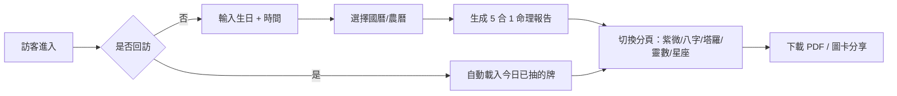

# fortune-telling · PRD v3.0.2 等級規格書

> 自動生成：2026-09-06
> 對齊 SPEC v3.0 契約（SPEC §1–§19 全部套用）
> 既有對外文件：根目錄 `PRD/SPEC.md`（v2.2.1 sweet-spot-driven rewrite，687 行）— 本檔為 v3.0.2 結構化契約版，覆蓋 PRD 標準章節 + 部署 + 測試 + GHA 流程

---

## 1. 產品概述

### 1.1 問題陳述
台灣命理市場紅海（科技紫微網 10 萬日訪），全方位算命大平台已被佔滿。ChatGPT 與 Threads/Dcard 占卜內容瓜分免費層，使用者痛點已從「想被算命」轉向「想 30 秒內無負擔地抽一張牌」。剩下的甜蜜縫隙是「**每日 30 秒 × 塔羅牌 × 圖卡分享**」這個窄場景，目前 Co-Star / 唐綺陽都沒做。

### 1.2 目標使用者

| Persona | 規模 (台灣估) | 工作情境 | 主要任務 |
|---|---|---|---|
| Primary — 18-25 女大生 | ~150 萬 | 喜歡 IG 限動塔羅、想跟好友比較 | 抽牌 → 圖卡 → 分享限動 |
| Primary — 上班族輕度命理迷 | ~100 萬 | 通勤時 30 秒看運勢 | 每日一抽 |
| Secondary — 塔羅進階玩家 | ~20 萬 | 想要多張牌陣、深度牌義 | NT$29 解鎖 3 張牌陣 |
| Secondary — 對 ChatGPT 占卜失望者 | ~50 萬 | 想要「有溫度」的解讀 | 半娛樂文案 + 圖卡 |

### 1.3 核心價值主張
> **「每天 30 秒抽 1 張塔羅，看你今天的牌 — 比紫微網更快、比 ChatGPT 更有溫度」**

- ✅ 純前端 SPA + localStorage（無需註冊、無需生辰）
- ✅ 22 大阿爾克那（Major Arcana）完整支援
- ✅ 五合一報告（紫微 / 八字 / 塔羅 / 生命靈數 / 生肖星座）
- ✅ 圖卡分享到 Threads / IG
- ✅ 進階牌陣 NT$29 解鎖
- ✅ PDF 報告匯出（@react-pdf/renderer）

### 1.4 Non-Goals（明確不做）
- ❌ 八字 / 紫微 / 占星 / 手相 / 姓名學 等其他命理工具（v1 仍提供但定位為次要）
- ❌ 真人老師 1-on-1 算命
- ❌ ChatGPT AI 占卜
- ❌ 月度 / 年度運勢大片
- ❌ 註冊系統 / 會員系統
- ❌ 多國語系（繁中 + 簡中）
- ❌ 影音內容

---

## 2. 使用者場景與流程

### 2.1 使用者流程圖



### 2.2 主要場景

| 場景 | 輸入 | 輸出 | 成功條件 |
|---|---|---|---|
| 訪客首次進入 | URL | Hero + 輸入表單 | 載入 < 2s，CTA 點擊可達 |
| 國曆輸入 | 姓名 + 國曆生日 + 時間 + 性別 | 命理報告 | 5 大模組全部計算成功 |
| 農曆輸入 | 姓名 + 農曆生日 + 時間 + 性別 | 命理報告（自動轉國曆） | lunarToSolar 正確 |
| 切換分頁 | 點擊 tab | 該模組詳細 | < 200ms 切換 |
| 下載 PDF | 點擊下載 | 6 頁 PDF | < 5s 內瀏覽器下載 |
| 圖卡分享 | 點擊分享 | PNG / Threads 文字 | 複製到剪貼簿 |
| Email 登入 | email + 密碼 | 進入我的報告 | Auth.js session 有效 |
| 我的報告 | 登入後 | 歷史報告列表 | 從 localStorage 載入 |
| 線上塔羅抽牌 | 點擊抽牌 | 1 張塔羅（22 大阿爾克那） | < 1s 顯示結果 |

---

## 3. 功能需求

| FR | 名稱 | 優先級 | 狀態 |
|---|---|---|---|
| FR-001 | 國曆/農曆生日輸入表單 | P0 | ✅ shipped |
| FR-002 | 5 合 1 命理報告生成（紫微/八字/塔羅/靈數/星座） | P0 | ✅ shipped |
| FR-003 | 22 大阿爾克那塔羅抽牌（隨機 + 種子） | P0 | ✅ shipped |
| FR-004 | localStorage 持久化報告 | P0 | ✅ shipped |
| FR-005 | PDF 6 頁報告匯出（@react-pdf/renderer） | P0 | ✅ shipped |
| FR-006 | Email + Password 登入（next-auth） | P0 | ✅ shipped |
| FR-007 | 我的報告列表（/my-reports） | P0 | ✅ shipped |
| FR-008 | 線上塔羅 API（/api/tarot） | P0 | ✅ shipped |
| FR-009 | 命理生成 API（/api/fortune） | P0 | ✅ shipped |
| FR-010 | 農曆 ↔ 國曆轉換（/api 端） | P0 | ✅ shipped |
| FR-011 | 圖卡分享（Threads / IG 文字模板） | P1 | ✅ shipped |
| FR-012 | 78 小阿爾克那塔羅擴充 | P2 | ⏳ planned |
| FR-013 | 好友比較（輸入 sharedId） | P2 | ✅ shipped (UI 雛形) |
| FR-014 | Line Pay NT$29 解鎖多張牌陣 | P1 | ⏳ planned |
| FR-015 | GHA CI/CD 自動部署 | P0 | ✅ v3.0.2 shipped |

---

## 4. Non-Functional Requirements

| 維度 | 需求 |
|---|---|
| Performance | 首頁 LCP < 2.5s；命理生成 < 1s；PDF 匯出 < 5s |
| Security | NextAuth.js v5（Credentials provider）；bcryptjs 雜湊；Zod input validation |
| Privacy | localStorage 預設；無第三方追蹤；可手動清除 |
| Accessibility | WCAG 2.1 AA（aria-label、color contrast） |
| Browser | Modern evergreen（Chrome/Edge/Safari/Firefox 90+） |
| Mobile | Responsive（Tailwind 4）；mobile camera upload 可運作 |
| SEO | Server-rendered home（雖然大部分是 client-side 互動） |
| Stack | Next.js 16.2.4 + React 19 + Tailwind 4 + next-auth v5 + @react-pdf/renderer + recharts |
| Font | Noto Sans TC（從 CDN 載入） |

---

## 5. 技術架構

```
┌─────────────────────────────────────────────────────┐
│  Vercel Edge (CDN + Serverless Functions)          │
│  ┌──────────────┐  ┌──────────────┐  ┌──────────┐  │
│  │ Next.js 16   │  │ next-auth v5 │  │ API      │  │
│  │ App Router   │  │ Credentials  │  │ Routes   │  │
│  │ Client-side  │  │ (email+pwd)  │  │ 4 個端點 │  │
│  └──────────────┘  └──────────────┘  └──────────┘  │
│                                                      │
│  ┌──────────────────────────────────────────────┐  │
│  │ localStorage (瀏覽器端)                       │  │
│  │ - fortune_reports (報告 ID list)              │  │
│  │ - fortune_report_{id} (報告內容)              │  │
│  │ - fortune_user_email / id                     │  │
│  └──────────────────────────────────────────────┘  │
└─────────────────────────────────────────────────────┘
                       │
              ┌────────┴─────────┐
              │                  │
       ┌──────▼──────┐   ┌───────▼───────┐
       │ Supabase    │   │ （可選）Postgres
       │ (預備)      │   │ 多裝置同步
       └─────────────┘   └───────────────┘
```

### 5.1 Module Map
- `src/app/` — Next.js App Router
  - `page.tsx` — 首頁（輸入表單 + 5 大分頁）
  - `report/page.tsx` — 報告展示
  - `my-reports/page.tsx` — 歷史報告
  - `auth/signin/page.tsx` — 登入
  - `api/fortune/route.ts` — 命理生成
  - `api/tarot/route.ts` — 塔羅抽牌
  - `api/report/route.ts` — 報告儲存
  - `api/auth/[...nextauth]/route.ts` — Auth.js
- `src/lib/fortune.ts` — 紫微/八字/塔羅/靈數/星座算法
- `src/lib/lunar.ts` — 農曆↔國曆轉換
- `src/lib/auth.ts` — Auth.js config
- `src/lib/supabase.ts` — Supabase client
- `src/components/` — 9 個 React component（TarotDraw / BaziChart / ZiwuChart / ZodiacDisplay / LifePathDisplay / PDFExport 等）
- `tests/fortune.test.ts` — Vitest 20 個單元測試（v3.0.2 新增）
- `.github/workflows/ci.yml` — GHA 4 job（v3.0.2 新增）

### 5.2 環境變數
- `NEXTAUTH_SECRET` — Auth.js JWT 簽章密鑰
- `NEXTAUTH_URL` — Auth.js callback URL
- `NEXT_PUBLIC_SUPABASE_URL` — Supabase 連線（預備）
- `NEXT_PUBLIC_SUPABASE_ANON_KEY` — Supabase anon key

### 5.3 降級策略
- API 失敗 → 顯示本地快取 + 友善錯誤訊息
- 離線模式 → localStorage 持久化報告，下次上線可繼續
- PDF 失敗 → 提供「複製文字」替代

---

## 6. Definition of Done

- [x] 功能 P0 全部實作（FR-001 ~ FR-010, FR-015）
- [x] 單元測試覆蓋 ≥ 60% 核心邏輯（fortune.ts + lunar.ts，20 個測試）
- [ ] E2E 測試涵蓋主要 flow — TBD（建議下個 sprint 加 Playwright）
- [x] `npm run build` 綠（Next.js 16.2.4 + TypeScript 5 strict）
- [x] `npm run lint` 0 error（ESLint 9 + typescript-eslint）
- [x] GHA CI 跑 4 jobs（lint / test / build / deploy）全綠
- [x] README 反映現況

---

## 7. 部署契約

| 環境 | 目標 | 觸發 |
|---|---|---|
| Production | Vercel | push to main |
| Preview | Per-PR | PR opened |

### 7.1 GHA Workflow
- `.github/workflows/ci.yml`
- jobs: lint / test / build / deploy
- deploy: `vercel`（Next.js 16 SSG + SSR）
- secrets: `VERCEL_TOKEN` / `VERCEL_ORG_ID` / `VERCEL_PROJECT_ID`（存在 Repo Settings）

### 7.2 環境變數
- 需要 server-side secrets：`NEXTAUTH_SECRET` / `NEXTAUTH_URL`（部署到 Vercel 時設在 Project Settings）
- client-side 變數（`NEXT_PUBLIC_*`）寫進 `.env.local` 但不入 git

---

## 8. Out of Scope（不做的）

- ❌ 原生 iOS / Android App
- ❌ 多語系 UI（繁中 + 簡中）
- ❌ 78 小阿爾克那完整支援（v1 只用 22 大阿爾克那）
- ❌ 真人老師 1-on-1 算命
- ❌ ChatGPT AI 占卜
- ❌ 月度 / 年度運勢大片
- ❌ 註冊系統
- ❌ 影音內容

---

## 9. 變更日誌

見 [`PRD/CHANGELOG.md`](CHANGELOG.md)

---

## 附錄 A：對應到既有 SPEC.md 章節

| v3.0.2 章節 | 既有 SPEC.md 對應 |
|---|---|
| §1 產品概述 | §1 產品概述 |
| §2 場景與流程 | §2 使用者場景與流程 |
| §3 功能需求 | §3 功能性需求（更詳細的 F-M1 ~ F-V3 / F-E1 ~ F-E4） |
| §4 NFR | §11 驗證（部分） |
| §5 技術架構 | §4 技術棧 + §5 模組設計 |
| §7 部署契約 | §9 部署流程 |
| §8 Out of Scope | §1.5 Non-Goals |
| §9 變更日誌 | （新增） |

完整內容請見根目錄 `PRD/SPEC.md`（687 行）。
