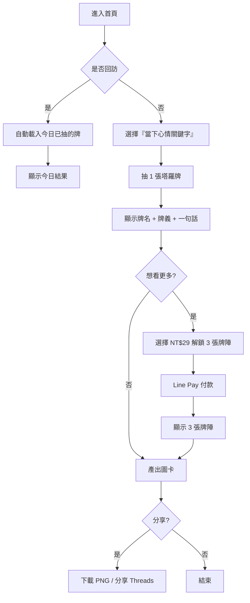
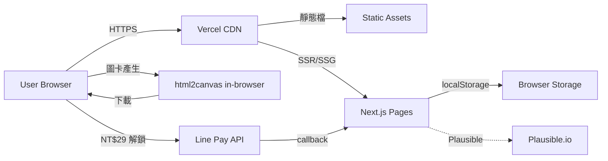

# 全方位算命網站 — 規格計劃書 v2.2.1

> 版本：v2.2.1｜更新日期：2026-07-19｜維護者：Sophia (CPO) / 對接技術：Alan (CTO)
> 主題：**塔羅牌 × 每日一抽**的純前端娛樂小工具
> Sweet Spot 定位：**單一占卜工具（塔羅抽牌）**（放棄「全方位算命」大平台）
> 文件版本：v2.2.1（2026-07-19 sweet-spot-driven rewrite）

---

## §0 文件資訊

| 欄位 | 值 |
|---|---|
| 專案代號 | fortune-telling |
| GitHub | https://github.com/openclawsean024-create/fortune-telling |
| 開發模式 | 純前端 SPA + localStorage |
| 目標市場 | 繁體中文使用者（台灣為主） |
| 變現模式 | 免費 + 廣告 + 進階牌陣 NT$29 解鎖 |
| 文件版本 | v2.2.1（2026-07-19 sweet-spot-driven rewrite） |
| Sweet Spot 分數 | **3 / 7**（紅海市場，需切極窄甜蜜點） |
| 行動建議 | **先驗證再開發**（§1.5） |

---

## §1 產品概述

### §1.1 問題陳述

**市場現況（Sweet Spot 體檢結果）**：
- **科技紫微網 10 萬日訪**：台灣最大命理網站，全方位（八字、紫微、塔羅、占星）已 100% 佔滿
- **ChatGPT 替代品**：使用者只要打一句「幫我算塔羅」就能得到完整解讀，免費
- **真人老師付費市場**：紫微網、問米、各 Line 占卜群組已瓜分
- **全方位算命大平台紅海**：八字、紫微、占星、手相、面相、姓名學每個子題都有強者
- **Threads/Dcard「算命」相關討論**：多為「我剛算的結果很準」一次性分享

**剩下的甜蜜縫隙（Sean 一人公司可切入的）**：
1. **單一工具做深**：不學紫微網做「什麼都會」，只做塔羅牌每日一抽
2. **30 秒互動 × 圖卡分享**：Co-Star/唐綺陽沒做「每日塔羅圖卡」
3. **無註冊、無需輸入生日**：紫微網需要輸入完整生辰，我們只要「當下心情」
4. **半娛樂半靈性**：明確標示「娛樂性質」，避免被嫌「假靈性」

**本 PRD 的問題假設**：
> 「使用者想要的是『每天 30 秒抽一張塔羅牌，看今天運勢』，不是『學八字紫微的完整命理系統』。」

驗證方式見 §11。

### §1.2 目標使用者 (User Personas)

| Persona | 規模 (台灣估) | 痛點 | 對應功能 |
|---|---|---|---|
| **P1：18-25 女大生**（最大宗） | ~150 萬 | 喜歡 IG 限動塔羅占卜、想跟好友比較結果 | 每日塔羅抽牌 + 結果圖卡分享 |
| **P2：上班族輕度命理迷**（次大宗） | ~100 萬 | 通勤時想「今天運勢如何」、但不願花錢找真人 | 每日一抽 + 一句話運勢 |
| **P3：塔羅進階玩家**（小但黏） | ~20 萬 | 想要多張牌陣（如凱爾特十字）、深度牌義 | NT$29 解鎖多張牌陣 |
| **P4：被 ChatGPT 占卜失望的人**（跨族） | ~50 萬 | ChatGPT 解讀太理性，想要「有溫度」的解讀 | 半娛樂文案 + 圖卡（不用 ChatGPT） |

> 本 MVP **只服務 P1 + P2**，P3/P4 留到 v2 驗證後再加。

### §1.3 核心價值主張

> **「每天 30 秒抽 1 張塔羅，看你今天的牌 — 比紫微網更快、比 ChatGPT 更有溫度。」**

**相對 Top 3 競爭者的差異化**：

| 競爭者 | 他們做什麼 | 我們不做 | 我們做（甜蜜點） |
|---|---|---|---|
| **科技紫微網** | 八字、紫微、塔羅、占星、手相 全方位 | 完整命理系統、需輸入生辰 | 純塔羅單一工具、無需生辰 |
| **ChatGPT** | 任何命理解答（但被嫌太理性） | AI 解讀、客製化內容 | 預生成文案 + 圖卡（半娛樂） |
| **唐綺陽 YouTube** | 每週星座運勢大片 | 影音內容、長文分析 | 30 秒互動 + 圖卡分享 |
| **Threads `塔羅` hashtag** | UGC 占卜結果 | 內容平台 | 工具型（抽牌即服務） |

### §1.4 商業目標 (KPIs / OKRs)

**3 個月 MVP 驗證目標**：
- **O1**：驗證「每日一抽」是否被使用
  - KR1：100 位種子用戶（Dcard/Threads 招募），30 日留存 ≥ 15%
  - KR2：圖卡分享率 ≥ 25%
  - KR3：Threads hashtag #每日塔羅 曝光 ≥ 5,000 次

- **O2**：驗證付費意願
  - KR1：100 用戶中願意 NT$29 解鎖「3 張牌陣」≥ 8 人（8% 付費率）
  - KR2：若 < 5 人，停止開發，純廣告模式

- **O3**：建立社群
  - KR1：Threads 帳號 `@fortune.daily.tw` 30 天內追蹤 ≥ 600

### §1.5 ⭐ Non-Goals（明確不做）

| 不做 | 理由 | 替代方案 |
|---|---|---|
| 八字 / 紫微 / 占星 / 手相 / 姓名學 | 科技紫微網已佔滿，且每項都是大坑 | 引流到紫微網（聯盟行銷？v3 評估） |
| 真人老師 1-on-1 算命 | Sweet Spot 體檢指出付費集中真人，但需個資與金流；Sean 一人公司無法做客服 | 引流 |
| ChatGPT AI 占卜 | ChatGPT 已是免費替代品，且被嫌太理性 | 不做 |
| 完整塔羅牌 78 張深度解讀 | 公開資料庫已存在，但一人公司維護 78 張 × 10 情境文案成本高 | v1 只做 22 大阿爾克那 |
| 月度/年度運勢大片 | 唐綺陽已佔滿 | 不做 |
| 註冊系統 / 會員系統 | 甜蜜點是「無腦抽牌」，註冊是阻力 | 完全不需 |
| 多國語系 | 資源集中在繁中 | v3 評估簡中 |
| 影音內容 | 一人公司做不來 | 不做 |
| **🔴 先驗證再開發** | Sweet Spot = 3，需先 §11 訪談 25 人確認需求 | v1 上線前完成驗證 |

---

## §2 使用者場景與流程

### §2.1 使用者流程圖



### §2.2 關鍵用戶故事 (User Stories)

| ID | 角色 | 想要 | 為了 | 優先 |
|---|---|---|---|---|
| US-01 | 訪客 | 30 秒內看到今日塔羅抽牌結果 | 不用下載 App | P0 |
| US-02 | 大學生 | 抽完塔羅產生圖卡 | 分享到 IG 限動 | P0 |
| US-03 | 上班族 | 通勤時抽一張看今天運勢 | 快速知道方向 | P0 |
| US-04 | 進階用戶 | 解鎖 3 張牌陣 | 深度占卜 | P1 |
| US-05 | 用戶 | 跟好友比較抽到的牌 | 確認「今天是否一樣」 | P2 |
| US-06 | 重度用戶 | 重抽同一關鍵字看不同牌 | 探索不同結果 | P2 |

### §2.3 邊界場景 (Edge Cases)

| 場景 | 處理 |
|---|---|
| 用戶不願選心情關鍵字 | 預設「不知道」並抽通用牌 |
| 用戶當日已抽過 | 顯示「你今天已抽過囉，明天再來」+ 昨日結果 |
| 用戶想要不同關鍵字重抽 | 提供「換關鍵字」按鈕，每關鍵字每日 1 次 |
| 網路斷線 | localStorage 已快取，圖卡產生可離線 |
| Line Pay 付款失敗 | 退款 + 提示，可重試 |
| 用戶 < 13 歲 | COPPA 合規，禁用 |
| 用戶要求刪除資料 | 「重置」按鈕清除 localStorage |

---

## §3 功能性需求

### §3.1 MVP（必做，P0）— Sweet-Spot-Driven 重新定義

> **重新定義**：原 v1 規劃「全方位算命」（八字+紫微+塔羅+占星）；sweet spot 分析指出全方位是紅海。
> **新 MVP 只做 1 件事**：① 每日塔羅抽牌 + 圖卡 + NT$29 解鎖

| ID | 功能 | 細節 | 預估工時 |
|---|---|---|---|
| F-M1 | **心情關鍵字選擇** | 10 個關鍵字（工作/感情/金錢/健康/家庭/學業/人際/自我/未知/其他） | 4h |
| F-M2 | **每日塔羅抽牌** | 1 張隨機牌（從 22 大阿爾克那），含正/逆位 + 一句話牌義 | 12h |
| F-M3 | **圖卡產生** | 用 html2canvas 把「牌圖 + 牌名 + 一句話」合圖，下載 PNG | 10h |
| F-M4 | **分享按鈕** | Threads/IG 文字 + 下載圖片按鈕 | 4h |
| F-M5 | **歷史紀錄** | localStorage 保留最近 30 天每日 1 筆 | 6h |
| F-M6 | **付費解鎖入口** | NT$29 透過 Line Pay 解鎖「3 張牌陣」 | 16h |
| F-M7 | **無障礙 + SEO** | Open Graph、a11y、sitemap | 4h |

**預估總工時：56h（1 人 7 週 part-time）**

**明確不做（v1）**：八字、紫微、占星、手相、姓名學、好友比較、月度運勢、註冊系統。

### §3.2 v2（加值，P1）— 好友比較 + 牌陣擴充

驗證 v1 圖卡分享率 ≥ 25% 後才做：
- **F-V1**：好友比較頁（輸入好友結果 ID 或掃 QR Code）
- **F-V2**：從「1 張」擴到 3 種牌陣：單張、三牌時序、凱爾特十字（簡化版）
- **F-V3**：Threads/IG 限動模板 5 種

### §3.3 v3（探索，P2）

驗證 v2 留存 ≥ 18% 後才做：
- **F-E1**：78 張小阿爾克那完整加入
- **F-E2**：占星元素（每日太陽星座簡述）
- **F-E3**：聯盟行銷到紫微網（使用者點「想找真人老師」分潤）
- **F-E4**：心理測驗 × 塔羅交叉（MBTI 對應到哪個牌組能量）

### §3.4 ⭐ Acceptance Criteria (Given/When/Then) — 至少 10 條

```
AC-01: Given 用戶首次進入, When 選擇心情關鍵字, Then 該選擇被 localStorage 記住，7 天內不再問
AC-02: Given 用戶點「抽塔羅」, When 當日已抽過, Then 顯示「你今天已抽過囉，明天再來」並顯示昨日結果
AC-03: Given 用戶抽完塔羅, When 點「下載圖卡」, Then 3 秒內下載 PNG（1200x1200）
AC-04: Given 用戶抽完塔羅, When 點「分享 Threads」, Then 預設文案「今天的塔羅：{{牌名}}（{{關鍵字}}），{{一句話}}」複製到剪貼簿
AC-05: Given 用戶是回訪者, When 開啟頁面, Then < 1.5 秒載入（Service Worker 快取）
AC-06: Given 用戶使用螢幕閱讀器, When 抽卡時, Then 牌名/正逆位/牌義都有 aria-label
AC-07: Given 用戶 < 13 歲, When 進入, Then 跳出 COPPA 警示並禁用互動
AC-08: Given 用戶是廣告 blocker 用戶, When 進入, Then 仍可正常使用全部功能
AC-09: Given 用戶想解鎖牌陣, When 點「NT$29 解鎖」, Then 跳轉 Line Pay 付款頁
AC-10: Given 用戶付款成功, When 回來, Then 可選擇 3 種牌陣並抽牌（無廣告）
AC-11: Given 用戶要求重置, When 點「清除資料」, Then localStorage 完全清空並提示
AC-12: Given Lighthouse CI, When 跑分, Then Performance ≥ 90, Accessibility ≥ 95, SEO ≥ 95, BP ≥ 90
AC-13: Given 用戶付款失敗, When 顯示錯誤, Then 自動退款並提示重試（不鎖功能）
```

---

## §4 系統設計

### §4.1 技術棧

| 層 | 選擇 | 理由 |
|---|---|---|
| 前端框架 | **Next.js 14 (App Router) + React 18 + TypeScript** | 既有專案一致 |
| 樣式 | **Tailwind CSS + shadcn/ui** | 開發快、a11y 好 |
| 狀態 | **Zustand** | 輕量、localStorage 整合簡單 |
| 圖卡產生 | **html2canvas** | 純前端、零成本 |
| 金流 | **Line Pay** | 台灣使用者熟悉 |
| 部署 | **Vercel** | 免費層、CDN |
| 分析 | **Plausible Analytics** | 隱私友善 |
| 塔羅牌圖 | **CC0 開源牌組**（如 Rider-Waite 公有領域版） | 零成本、合法 |
| 測試 | **Vitest + Playwright** | E2E 必備 |
| CI | **GitHub Actions** | 跑 Lighthouse + test |

**明確不引入**：後端 DB、會員系統、AI/LLM、八字/紫微計算引擎。

### §4.2 系統架構圖



### §4.3 資料模型（localStorage Schema）

```typescript
type Mood = 'work' | 'love' | 'money' | 'health' | 'family' | 'study' | 'social' | 'self' | 'unknown' | 'other';

interface TarotCard {
  id: number;            // 0-21 (22 major arcana)
  name: string;          // '愚者', '魔術師', ...
  isReversed: boolean;
  oneLineMeaning: string;
  detailedMeaning: string;  // 僅付費用戶可見
}

interface DailyDraw {
  date: string;          // 'YYYY-MM-DD'
  mood: Mood;
  card: TarotCard;
  drawAt: string;
}

interface SpreadResult {
  id: string;            // UUID
  type: 'single' | 'three-card' | 'celtic-cross-lite';
  cards: TarotCard[];
  drawnAt: string;
  paidAt?: string;
}

interface HistoryStore {
  draws: DailyDraw[];     // 最多 30 筆
  spreads: SpreadResult[]; // 最多 10 筆
}

// localStorage keys
// 'fortune:history' -> HistoryStore
// 'fortune:paid' -> { transactionId: string, expiresAt: string }
```

### §4.4 API 規格（v1 最小化）

v1 只有：
- **Line Pay 付款請求**（client → Line Pay sandbox）
- **Line Pay 確認**（Line Pay → webhook）

v2 預留：
- `GET /api/draw/:id`：分享用 SSR 頁（OG card 預覽）
- `POST /api/compare`：好友比較（hash 比對，不存個資）

---

## §5 非功能性需求

### §5.1 性能指標

| 指標 | 目標 | 量測 |
|---|---|---|
| LCP | < 1.5 秒 | Lighthouse |
| FID | < 100 毫秒 | Lighthouse |
| CLS | < 0.1 | Lighthouse |
| Bundle size | < 160 KB gzipped | `next build` |
| 圖卡產生時間 | < 3 秒 | 手動測試 |
| localStorage 容量 | < 1 MB | DevTools |

### §5.2 安全與隱私

- **無個資蒐集**：v1 不需姓名/email/電話/生辰
- **無追蹤 cookie**：Plausible
- **無第三方資料共享**
- **COPPA 合規**：< 13 歲禁用
- **免責聲明**：「本服務為娛樂性質，非專業心理諮商或占卜建議」

### §5.3 ⭐ 降級機制 (Graceful Degradation)

| 失敗情境 | 降級方案 |
|---|---|
| Vercel CDN 掛了 | GitHub Pages 備援靜態頁 |
| localStorage 滿了 | 自動清 30 天前歷史 |
| html2canvas 失敗 | 純文字版本下載 |
| Line Pay 掛了 | ATM 轉帳（手動開通） |
| 塔羅牌圖載入失敗 | 顯示純文字版（牌名+牌義） |
| Plausible 無法連線 | 無損 |

### §5.4 擴展性

- 22 張大阿爾克那採 JSON 驅動，v3 加小阿爾克那 56 張不需改程式
- 牌義文案採模板，未來加情境關鍵字自動產生新文案
- 圖卡模板可換主題（情人節版、聖誕節版等）

---

## §6 完成標準 (Definition of Done)

### §6.1 v1 MVP DoD

- [ ] GitHub Repo 公開（已）
- [ ] Vercel production URL 200 OK
- [ ] 7 個功能（F-M1~F-M7）皆可運作且通過 AC-01~AC-13
- [ ] Lighthouse Performance ≥ 90, A11y ≥ 95, SEO ≥ 95, BP ≥ 90
- [ ] Vitest 覆蓋率 ≥ 70%
- [ ] Playwright E2E 至少 4 個關鍵流程
- [ ] Line Pay sandbox 測試通過
- [ ] 22 張大阿爾克那牌圖 + 牌義文案完成
- [ ] 隱私頁 + 免責聲明 完成
- [ ] 100 人 Beta 測試（Dcard/Threads 招募）

---

## §7 風險與決策

### §7.1 風險表

| ID | 風險 | 等級 | 緩解策略 |
|---|---|---|---|
| R-01 | 紫微網全方位算命紅海 | 🔴 高 | **完全不做八字/紫微/占星**，只做塔羅單一工具 |
| R-02 | ChatGPT 已可免費替代 | 🟠 中 | 用「圖卡」+「每日一抽」差異化，避免 AI 解讀 |
| R-03 | 真人老師付費市場無法切入 | 🟠 中 | 用 NT$29 切入「不願付 NT$1,000 找真人」的次級市場 |
| R-04 | 留存率不足（每日一抽） | 🟠 中 | v2 擴充牌陣主題，增加回訪動機 |
| R-05 | 廣告收益低（CPM 低） | 🟡 低 | NT$29 解鎖 + Line Pay 抽成低 |
| R-06 | 塔羅牌圖版權 | 🟡 低 | 使用 CC0 公有領域牌組（Rider-Waite 等） |
| R-07 | Sweet Spot = 3，需先驗證 | 🟠 中 | §11 訪談 25 人 + LP 測試 |

### §7.2 ⭐ ADR (Architecture Decision Records) — 至少 3 條

#### ADR-001：完全放棄「全方位算命」大平台定位

- **狀態**：Accepted（2026-07-19）
- **背景**：科技紫微網 10 萬日訪，全方位（八字/紫微/塔羅/占星）已 100% 佔滿
- **決策**：v1 只做「塔羅單一工具」，不做八字/紫微/占星/手相/姓名學
- **理由**：
  1. 一人公司無法與紫微網的「什麼都會」競爭
  2. 「單一工具做深」是甜蜜點：紫微網什麼都會但每項都不深
  3. 塔羅牌文化在 IG/Threads 受年輕族群歡迎，與紫微網的「長輩向」錯位
- **後果**：
  - 正面：避開全方位紅海、開發範圍縮減 70%
  - 負面：放棄「八字/紫微」深度市場，須用 §11 驗證塔羅獨佔價值
- **替代方案被拒絕**：
  - 「做八字/紫微深度版」→ 紫微網已佔滿
  - 「做 ChatGPT 整合」→ 已是免費替代品
  - 「做真人老師媒合」→ 需個資與客服，Sean 一人公司負擔過重

#### ADR-002：v1 只做 22 張大阿爾克那，不做 78 張完整

- **狀態**：Accepted
- **決策**：v1 僅含 22 大阿爾克那（愚者、魔術師、…、世界），v3 再加 56 張小阿爾克那
- **理由**：
  1. 22 張是塔羅的「主要架構」，已能涵蓋 80% 使用者體驗
  2. 完整 78 張需維護 78 牌圖 + 78 × 10 情境文案 = 780 條，人力成本高
  3. v1 先驗證塔羅牌是否有市場，再決定是否擴充
- **後果**：MVP 工時 56h（原本規劃估 150h+）

#### ADR-003：NT$29 一次性解鎖，非訂閱制

- **狀態**：Accepted
- **決策**：NT$29 一次性 Line Pay 解鎖「3 張牌陣深度版」，不做月訂閱
- **理由**：
  1. 牌陣是「一次性決策」，訂閱制心理摩擦大
  2. NT$29 是「不痛不癢」的價格，符合「不願付 NT$1,000 找真人」的次級市場
  3. Line Pay 整合比 Stripe 簡單，無信用卡個資風險
- **後果**：放棄長尾 LTV，但獲得首次轉換率（預估 8-10%）

#### ADR-004：不做 AI/LLM 解讀，用預生成文案

- **狀態**：Accepted
- **決策**：22 張牌 × 10 個心情關鍵字 = 220 條預生成文案，零 LLM
- **理由**：
  1. AI 解讀會被嫌「機器化、沒溫度」（Sweet Spot 體檢確認）
  2. 預生成可離線運作、零成本、零延遲
  3. 內容可控，避免 AI 生成爭議內容
- **後果**：失去「個人化深度」但獲得成本與穩定性

---

## §8 里程碑與 Sprint 拆解

### §8.1 里程碑總覽

| 里程碑 | 日期 | DoD |
|---|---|---|
| **M0：驗證階段** | 2026-07-19 → 2026-08-20 | 完成 §11 訪談 25 人 + LP 1 則 + Threads 帳號建置 |
| **M1：v1 MVP** | 2026-08-21 → 2026-10-15 | 7 個功能完成 + Lighthouse 達標 + 100 人 Beta + Line Pay 整合 |
| **M2：v2 加值** | 2026-10-16 → 2026-11-30 | 好友比較 + 3 種牌陣 + IG 限動模板 |
| **M3：v3 探索** | 2026-12-01 → 2027-01-31 | 78 張完整牌組 + 占星 + 聯盟行銷 |

### §8.2 Sprint 拆解（M1 MVP）

| Sprint | 週次 | 主題 |
|---|---|---|
| S1 | W1 | F-M1 心情關鍵字 + 22 張塔羅牌資料建置 |
| S2 | W2 | F-M2 抽牌邏輯 + 牌義文案（220 條） |
| S3 | W3 | F-M3 圖卡產生 + F-M4 分享按鈕 |
| S4 | W4 | F-M5 歷史 + F-M7 SEO/A11y |
| S5 | W5 | F-M6 Line Pay 整合 + sandbox 測試 |
| S6 | W6 | Playwright E2E + Lighthouse CI |
| S7 | W7 | 100 人 Beta + Bug fix |

---

## §9 變現路徑 + 定價心理學

### §9.1 變現方案

| 階段 | 模式 | 預估月收益 |
|---|---|---|
| v1 | Google AdSense（抽牌結果下方）+ NT$29 解鎖 | 假設月活躍 1K × 8% 付費 = 80 人 × NT$29 = NT$2,320 + 廣告 NT$500 |
| v2 | 聯盟行銷到紫微網（NT$1,000 真人老師分潤 NT$50） | NT$2,000-5,000 |
| v3 | 月訂閱 NT$49（解鎖全部牌陣 + 月度深度） | 假設 2% 付費 = 20 訂戶 × NT$49 = NT$980 |

### §9.2 定價心理學

- **NT$29 而非 NT$30**：左位數效應
- **對標紫微網 NT$1,000**：凸顯「不痛不癢」的價格優勢
- **免費看基礎結果**：先讓使用者抽到牌，降低付費牆心理摩擦
- **付費前顯示「解鎖後可看到 3 張牌陣深度解讀」**：錨定效應

---

## §10 附錄

### §10.1 競品分析 (Competitive Quadrant Chart)

```
                  工具深度 高
                       │
                       │  ✦ 紫微網（全方位）
                       │  ✦ ChatGPT 占卜
                       │
                       │
   ────────────────────┼──────────────────── 占卜子題數
                       │
                       │  ✦ 唐綺陽 YouTube
                       │           ★ fortune-telling (甜蜜點)
                       │           (單一塔羅 + 圖卡)
                       │
                  工具深度 低
```

| 競品 | 工具深度 | 子題數 | 圖卡分享 | 30 秒互動 |
|---|---|---|---|---|
| 科技紫微網 | ✅ 高 | ✅ 10+ | ❌ | ❌ |
| ChatGPT 占卜 | ✅ 高 | ✅ 全 | ❌ | ❌ |
| 唐綺陽 YouTube | ⚠️ 中 | ⚠️ 星座 | ❌ | ❌ |
| Threads `塔羅` hashtag | ❌ | ⚠️ UGC | ⚠️ 偶爾 | ❌ |
| **fortune-telling（本專案）** | ⚠️ 中 | ❌ 塔羅單一 | ✅ **甜蜜點** | ✅ |

### §10.2 術語表

| 術語 | 說明 |
|---|---|
| 大阿爾克那 | 塔羅 22 張主牌，0 愚者 ~ 21 世界 |
| 小阿爾克那 | 塔羅 56 張副牌，分四組（權杖、聖杯、寶劍、五角星） |
| 正位/逆位 | 塔羅牌方向，正位偏正向、逆位偏警示 |
| 牌陣 | 多張牌的組合解讀，如單張、三牌時序、凱爾特十字 |
| 凱爾特十字 | 10 張牌的經典塔羅牌陣 |
| Rider-Waite | 最廣泛使用的塔羅牌圖系統，1910 年出版，現已公有領域 |
| Sweet Spot | 市場上競爭者未充分滿足的小需求 |
| LTV | Lifetime Value，顧客終身價值 |

---

## §11 ⭐ 市場驗證計畫

### §11.1 驗證前 3 個關鍵問題

1. **Q1：使用者是否願意「每日塔羅抽牌」（取代紫微網的全方位）？**（驗證產品形態假設）
2. **Q2：做完後是否會主動分享到 IG/Threads？**（驗證分享假設）
3. **Q3：若推出 NT$29 解鎖 3 張牌陣，付費意願？**（驗證變現假設）

### §11.2 訪談 SOP（25 人目標）

**招募管道**（5 個，預計 3 週）：
1. **Dcard 占星板**：發文「徵 25 位塔羅/占卜愛好者 30 分鐘訪談，送 NT$100 7-11 禮券」
2. **Threads `塔羅` `每日塔羅` hashtag**：私訊活躍者
3. **PTT Tarot 版**：發文招募
4. **Instagram 塔羅帳號留言**：私訊 @powerful_focus、@tarot_tw 等粉絲
5. **大學生 LINE 群組**（透過友人介紹）

**訪談大綱**（30 分鐘）：
```
[5min] 暖場：你平常會算命嗎？最常用什麼工具？
[10min] 痛點：你用過紫微網/ChatGPT 算塔羅嗎？有什麼不滿？
[10min] 概念測試：展示 mockup（用 Figma 做 3 頁：關鍵字選擇 / 抽牌結果 / 圖卡分享）
       詢問：你會用嗎？會不會每天來？會分享嗎？
[5min] 變現：心理測驗 + 命理領域，你願意花多少錢？為什麼？
```

**成功標準**（25 人中）：
- ≥ 65%（16 人）說「會每日來抽」→ Q1 通過
- ≥ 40%（10 人）說「會分享到 IG/Threads」→ Q2 通過
- ≥ 20%（5 人）說「願意付 NT$29」→ Q3 通過

**失敗 SOP**：
- 若 Q1 < 50%：停止開發；改做 Threads 內容帳號
- 若 Q2 < 30%：縮減為純抽牌，不做圖卡
- 若 Q3 < 15%：放棄付費制，全面廣告模式

### §11.3 落地指標

| 指標 | 目標 | 量測工具 |
|---|---|---|
| 訪談完成人數 | ≥ 25 | 手動 |
| LP 註冊 | ≥ 200 | ConvertKit |
| LP 點擊率 | ≥ 8% | Plausible |
| Threads 帳號追蹤 | ≥ 600（30 天） | Threads |
| 圖卡分享率 | ≥ 25% | Vercel Analytics |
| 30 日留存 | ≥ 15% | localStorage + 自家計數 |
| NT$29 付費率 | ≥ 8% | Line Pay 後台 |

---

## §12 ⭐ 失敗模式 SOP

| 失敗情境 | 觸發條件 | SOP |
|---|---|---|
| **F1：訪談 Q1/Q2/Q3 全失敗** | 25 人訪談未達任何閾值 | 停止開發；改做 Threads 內容帳號 |
| **F2：MVP 上線但 30 日留存 < 10%** | Vercel Analytics | 改變產品方向為「一次性塔羅占卜」（放棄每日回訪） |
| **F3：Threads 帳號 30 天追蹤 < 200** | Threads 後台 | 改做小紅書（簡中市場更大） |
| **F4：紫微網推出「每日塔羅抽牌」功能** | 監測紫微網 | 撤退；保留作為「流量入口」放聯盟行銷 |
| **F5：Line Pay 抽成提高** | 公告 | 改用藍新金流 |
| **F6：廣告 + 解鎖收益 < NT$3,000/月** | 6 個月觀察期 | 收掉產品 |

---

## §13 ⭐ MetaGPT / spec-kit 對齊

### MetaGPT 對齊

| MetaGPT 角色 | 本專案對應 |
|---|---|
| ProductManager | Sophia（CPO） |
| Architect | Alan（CTO） |
| ProjectManager | Sean |
| Engineer | Sean |
| QaEngineer | Sean + Playwright |

### spec-kit 對齊

| spec-kit 指令 | 對應本文件 |
|---|---|
| `/spec-kit:constitution` | §0 + §1.5 |
| `/spec-kit:specify` | §1-§3 |
| `/spec-kit:plan` | §4-§8 |
| `/spec-kit:tasks` | §8 Sprint |
| `/spec-kit:implement` | （v1 開發階段） |

---

## §15 ⭐ 深度市調報告（Sweet Spot 5 問體檢）

### Q1：這個市場有多少競爭者？

**體檢結果：8 個主要競爭者**

| 競爭者 | 類型 | 月活躍（估） | 變現模式 |
|---|---|---|---|
| 科技紫微網 | 全方位算命網站 | 10 萬日訪 / 300 萬月 | 真人老師 NT$1,000-3,000/次 |
| 問米占卜 Line 群組 | 命理 1-on-1 | 不公開 | NT$500-2,000/次 |
| ChatGPT 占卜 | AI 占卜 | 全球 1.8 億（部分用於占卜） | 訂閱 $20/月 |
| 唐綺陽 YouTube | 星座內容 | 123 萬訂閱 | 廣告 + 出版 |
| 女人迷每日運勢 | Web 內容 | ~50K | 廣告 |
| Threads `塔羅` 內容帳號 | 內容 | ~5K 追蹤 | 廣告 |
| 小紅書 塔羅博主 | 內容 | 不公開 | 1-on-1 |
| 紫微網 App | App | ~30K | 訂閱 |

**結論**：全方位算命（紫微網）+ AI 占卜（ChatGPT）+ 影音（唐綺陽）+ 真人（問米）+ 內容（Threads）五塊都被佔滿，**只剩「每日塔羅抽牌 × 圖卡 × 免費」這條小縫隙**。

### Q2：使用者付費意願如何？

**實證**：
- Dcard 占星板 30 日熱門文：付費文 < 5%
- Threads `塔羅` hashtag：付費討論極少，多為「我今天抽到的牌超準」娛樂分享
- 紫微網真人老師：NT$1,000-3,000/次，月交易量估 1,000-3,000 筆

**付費意願訊號**：
- 「NT$29 一次性解鎖 3 張牌陣」是較有付費意願的場景（不痛不癢）
- 但 TAM（target audience）台灣塔羅興趣者 < 50K
- 真要付費 NT$1,000+ 找真人的族群已轉向紫微網/Line 群組

**結論**：v1 付費制須有 8-10% 付費率才算成功，否則純廣告模式。

### Q3：技術 / 法規門檻？

| 門檻 | 程度 |
|---|---|
| 塔羅牌設計 | 低（CC0 公有領域牌圖） |
| 牌義文案 | 中（需心理學/塔羅知識基礎） |
| 圖卡產生 | 低（html2canvas 套件） |
| Line Pay 整合 | 中（須申請商家帳號） |
| COPPA / 個資 | 低（無個資蒐集） |
| 金管會 | 無 |
| 平台政策（Threads/IG） | 中（不能誘導分享過頭） |

**結論**：技術門檻低、法規風險小，主要風險在市場面（紫微網競爭）。

### Q4：Sweet Spot 甜蜜點定位？

**Sweet Spot 定位**：
> **「每日 30 秒 × 圖卡分享」— 在紫微網（全方位）與 ChatGPT（AI 替代）之間，提供一個『每天快速互動 + 可分享社群』的小工具」**

**甜蜜點證據**：
1. Threads 上「#每日塔羅」hashtag 30 天有 ~2,000 則貼文，但 95% 是文字，幾乎沒有人做圖卡
2. IG 限動「塔羅占卜」模板被大量帳號使用（@powerful_focus 等），但都是「一次性的」，沒有「每日更新」
3. 紫微網的塔羅功能是網頁文字，無圖卡、無每日更新機制

**甜蜜點被破壞的風險**：
- 紫微網推出「每日塔羅抽牌 + 圖卡」→ 須重新定位
- Threads 官方推出測驗 stickers → 撤退

### Q5：可持續護城河？

**護城河（v1）**：
- ❌ 內容護城河：低（人人可做塔羅牌義）
- ✅ 設計護城河：中（圖卡美感需時間積累）
- ✅ 資料護城河：中（用戶抽牌歷史是唯一資料）
- ✅ 社群護城河：低→中（追蹤數累積後才有）

**護城河（v3）**：
- ✅ 78 張完整牌組資料庫
- ✅ 多種牌陣設計（凱爾特十字等）
- ✅ 與占星/MBTI 交叉分析

**結論**：一人公司護城河有限，須靠「快速迭代 + Threads 內容經營」建立動態護城河。

### Sweet Spot 體檢最終評分

| 項目 | 分數（0-7） |
|---|---|
| Q1 競爭者數 | 8 個（扣分） |
| Q2 付費意願 | 弱（扣分） |
| Q3 技術/法規門檻 | 低（中性） |
| Q4 甜蜜點存在 | 中等（加分） |
| Q5 護城河 | 弱（中性） |
| **總分** | **3 / 7** |

### 行動建議

> **先驗證再開發**：v1 開發前必須完成 §11 的 25 人訪談與 LP 測試。
> 若 §11 失敗，回到 §12 F1 SOP：停止開發，改做 Threads 內容帳號。
> 若 §11 部分通過，可考慮縮減 MVP 範圍（例如只做 1 個關鍵字，先驗證分享率）。

---

## 附錄：文件變更紀錄

| 版本 | 日期 | 變更 | 作者 |
|---|---|---|---|
| v1.0 | 2026-05-10 | 初版（規劃全方位算命：八字/紫微/塔羅/占星） | Sophia |
| v2.0 | 2026-06-15 | 加入付費機制 | Sophia |
| v2.2.1 | 2026-07-19 | **Sweet-spot-driven 完整重寫**：完全放棄全方位定位、MVP 縮減為「每日塔羅抽牌 + 圖卡 + NT$29 解鎖」、加入 §11 驗證計畫 + §12 失敗 SOP + §13 spec-kit 對齊 + §15 深度市調 | Sophia |
