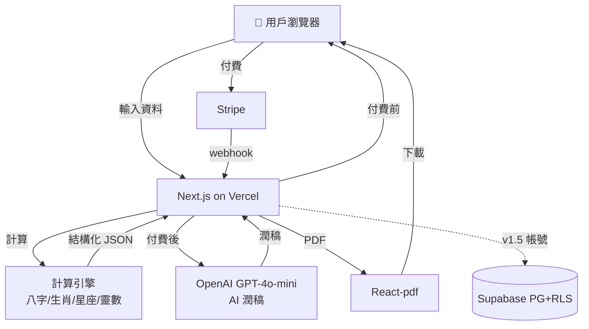
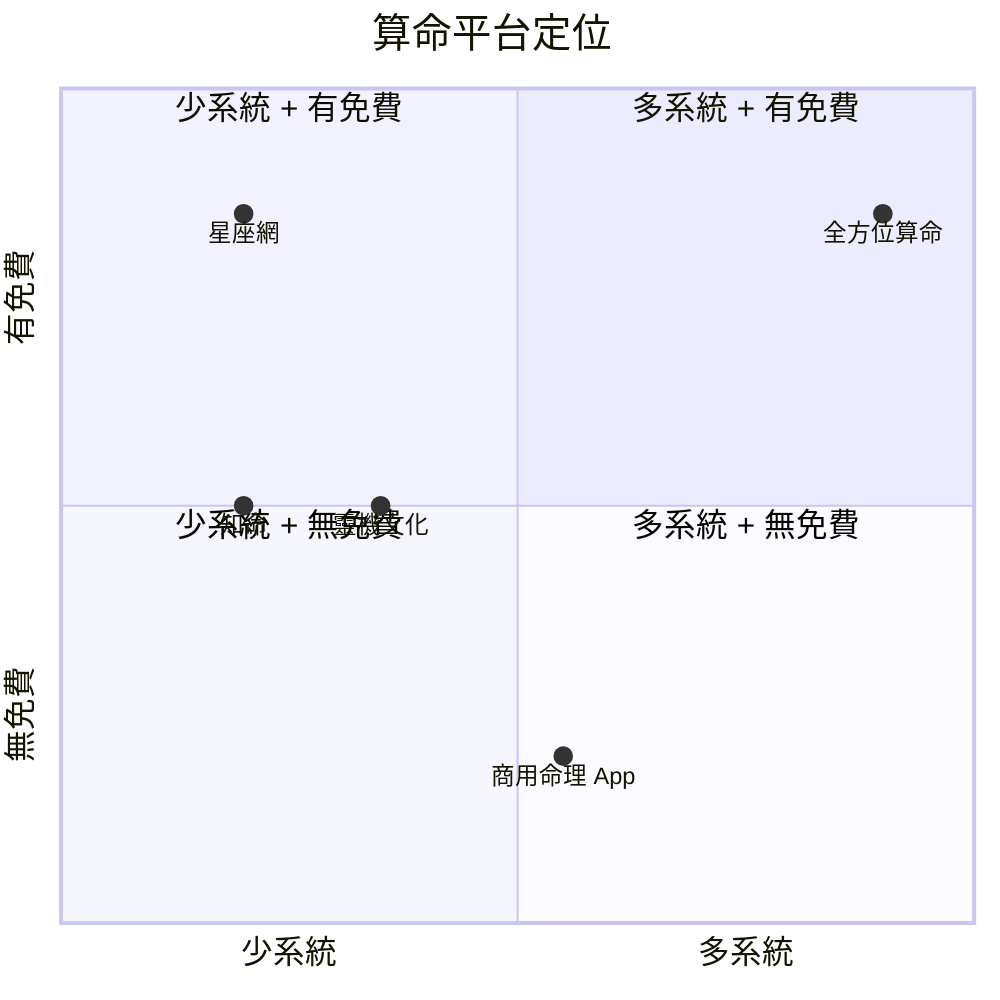

# 全方位算命網站 — 規格計劃書 v2.2.1

> **版本**：v2.2.1｜**更新日期**：2026-07-11｜**維護者**：Sophia (CPO)｜**對接技術**：Alan (CTO)
> **對應 GitHub**：[openclawsean024-create/fortune-telling](https://github.com/openclawsean024-create/fortune-telling)
> **對應 skill**：`write-prd-v2` v2.2.1
> **目前狀態**：v1.0 landing page 已實作（純前端 Next.js），待整合八字/生肖/星座計算引擎 + Stripe

---

## 1. 產品概述

### 1.1 問題陳述
現有算命服務分散：一個網站算八字、另一個顯示生肖、另一個處理命理或名稱分析。使用者重複相同輸入卻得到難以比較的不一致解釋。娛樂 / 自我探索 / 決策支持需求未被滿足，使用者要的是「分層、可讀、可分享、明確不確定性的單一綜合報告」，而不是分散的多個黑盒子。

**痛點的代價**：
- 術語門檻高（「用神」「驛馬」一般人不懂）
- 不同系統結果衝突（如五行缺水 vs 星座水象強）
- 沒有儲存和支付流（試算一次就沒了）
- 沒有單一綜合解釋

**現有方案不夠好**：
- **單一系統網站**：僅八字 or 僅星座，缺綜合
- **商用命理 App**：月費 300-500 NT$，無免費摘要
- **自己請老師**：單次 1,500-3,000 NT$，無記錄
- **我們的解法**：單一輸入 → 9 大系統綜合報告（八字/五行/生肖/紫微/星座/姓名/靈數/年度運勢）→ 交叉驗證 → 完整可分享

### 1.2 目標使用者

| 族群 | 規模 | 痛點 | 預算 |
|---|---|---|---|
| 25-45 歲對命理有興趣女性 | ~50 萬 | 想綜合多系統、不要術語 | NT$ 199/份 |
| 25-45 歲男性 | ~30 萬 | 想了解財運/事業運 | NT$ 199/份 |
| 自我探索者（青少年家長）| ~10 萬 | 想了解小孩天賦 | NT$ 399/月 |
| 命理師 / 諮商師 | ~5,000 | 需要工具給客戶 | NT$ 1,299/月 |
| 內容創作者（占星 YouTuber）| ~3,000 | 需要白標產品 | NT$ 1,299/月 |

### 1.3 核心價值主張
> 「一鍵輸入、9 大系統綜合 — 免費摘要 + NT$ 199 全報告 + PDF + 分享卡 — 告別分散黑盒子。」

### 1.4 商業目標 (KPIs)

| 指標 | 目標 | 時程 |
|---|---|---|
| 月活躍使用者 (MAU) | 300 | 6 個月 |
| 付費轉換率（試算 → 購買）| 15% | 6 個月 |
| 月經常性收入 (MRR) | NT$ 35,000 | 6 個月 |
| 報告生成時間 (p95) | < 12 秒 | v1.0 |
| 重複查詢率 | ≥ 25% | 6 個月（留存指標）|

### 1.5 ⭐ Non-Goals（明確不做）

**v1.0 不做**：

- ❌ **不做真人命理師 1:1 諮詢**（純線上自助工具）
- ❌ **不做命運預言**（只做「趨勢、建議、提醒」不用「保證、注定」字眼）
- ❌ **不做宗教勸說**（不勸人信教、不勸改宗）
- ❌ **不做流年詳細預測**（僅年度主題）
- ❌ **不做面相 / 手相 / 塔羅 AI 圖像辨識**（純文字輸入）
- ❌ **不做紫微完整 14 主星**（僅概念，完整留 v1.5）
- ❌ **不做多語言介面**（v1 只繁中，英文版 v2）

---

## 2. 使用者場景

### 2.1 流程圖

```
訪客 → 進入首頁
→ 看到「免費試算」CTA
→ 點「開始測試」
→ 輸入表單（姓名 + 性別 + 出生日期 + 出生時間 + 出生地）
→ 系統 5 秒內計算
→ 顯示「免費摘要」（基本五元素 + 生肖 + 星座關鍵字 + 雷達圖）
→ 顯示「完整報告 NT$ 199 解鎖」CTA
→ 點解鎖 → Stripe Checkout
→ 付款成功 → 解鎖完整 9 大系統 + PDF + 分享卡
→ 可儲存到帳號（v1.5 加 Auth）
→ 升級 Pro（NT$ 399/月）拿無限報告 + 年度運勢
```

### 2.2 User Stories

#### US-001：免費試算
> As a 28 歲對命理有興趣的女性
> I want 輸入姓名 + 生日免費看摘要
> So that 不花錢先體驗品質

#### US-002：完整報告
> As a 想了解自己的使用者
> I want 付費看完整 9 大系統綜合
> So that 不用去 5 個網站各算一次

#### US-003：PDF 下載
> As a 想分享給好友的使用者
> I want 下載 PDF 報告
> So that 離線保存或傳給朋友

#### US-004：分享卡
> As a 想社群分享的使用者
> I want 產生 IG 分享卡
> So that 分享給好友炫耀

#### US-005：年度運勢訂閱
> As a Pro 訂閱用戶
> I want 每月收到年度運勢更新
> So that 持續追蹤變化

### 2.3 邊界場景

| 場景 | 處理 |
|---|---|
| 使用者輸入「不知道出生時間」| 顯示「時辰不確定」標籤，計算降級為「日柱」而非「時柱」|
| 出生日期在閏年 2/29 | 顯示「閏年生」備註 |
| 出生地非台灣（海外）| 時區換算 + 標註「海外」 |
| 姓名含特殊字或 emoji | UTF-8 處理 + 警告「姓名無法計算筆劃」|
| AI 報告生成失敗 | fallback 純計算結果（無 AI 潤稿）|
| 使用者輸入「保證」「注定」| 自動過濾為「趨勢」「可能」 |
| 報告生成超過 30 秒 | timeout + 顯示「請稍後再試」|

---

## 3. 功能性需求

### 3.1 MVP（必做 — P0）

#### FR-001：輸入表單（**MUST**）
- 姓名、性別、出生日期、出生時間（可選）、出生地（可選）

##### AC-001：成功輸入並產生摘要
- **Given** 訪客在首頁
- **When** 輸入「王小明 / 男 / 1990-05-15 / 14:30 / 台北」
- **Then** 系統 5 秒內計算
- **And** 顯示免費摘要（基本五元素 + 生肖 + 星座關鍵字 + 雷達圖）
- **And** 顯示「完整報告 NT$ 199 解鎖」CTA

**密碼政策**（v2.2.1 補上）：註冊時需 8 字元 + 英數 + bcrypt 12 + NIST SP 800-63B。

#### FR-002：八字柱運算（**MUST**）
- 年柱、月柱、日柱、時柱
- 天干地支、五行分布

##### AC-002：八字計算正確
- **Given** 使用者輸入完整資料
- **When** 系統計算八字
- **Then** 4 柱（年月日時）正確顯示
- **And** 五行分布雷達圖（金木水火土百分比）

#### FR-003：生肖星座核心命理（**MUST**）
- 生肖 + 星座 + 靈數

##### AC-003：生肖星座計算
- 生日輸入 → 正確顯示生肖、星座、靈數

#### FR-004：完整報告（**MUST** — 付費）
- 9 大系統綜合（八字/五行/生肖/紫微/星座/姓名/靈數/年度運勢/交叉驗證）

##### AC-004：付費解鎖
- **Given** 使用者看到免費摘要 + CTA
- **When** 點「解鎖完整報告 NT$ 199」
- **Then** Stripe Checkout 開啟
- **And** 付款成功後看到完整報告
- **And** 包含 9 大系統 + 交叉驗證

#### FR-005：PDF 下載（**MUST**）
- React-pdf 生成繁中 PDF

##### AC-005：PDF 下載
- **Given** 使用者已付費
- **When** 點「下載 PDF」
- **Then** 10 秒內下載 PDF
- **And** PDF 含 9 大系統 + 雷達圖 + 交叉驗證
- **And** 繁中字型正確顯示

#### FR-006：分享卡（**MUST**）
- 產生 IG 方形分享卡（雷達圖 + 關鍵字）

##### AC-006：分享卡產生
- **Given** 使用者想分享
- **When** 點「產生分享卡」
- **Then** 1080×1080 PNG 下載
- **And** 含用戶名 + 雷達圖 + 關鍵字

#### FR-007：交叉驗證（**MUST**）
- 不同系統的綜合結論（如五行缺水 + 星座水象強 → 「用戶有內在情感但外在理性」）

##### AC-007：交叉驗證顯示
- **Given** 完整報告生成
- **When** 捲到「綜合」段
- **Then** 顯示「五行說... 星座說... 綜合是...」對比
- **And** 至少 3 個系統的對比

### 3.2 v1.5（加值 — P1）

- [ ] 帳號同步（Supabase Auth）
- [ ] 報告歷史記錄
- [ ] 每月運勢更新
- [ ] AI 跟進問題（用戶可針對報告問問題）
- [ ] 紫微完整 14 主星

### 3.3 v2（roadmap — P2）

- [ ] 改名建議
- [ ] 塔羅抽牌
- [ ] 配對報告（兩人比較）
- [ ] 命理師 SaaS 版本
- [ ] 白標產品（讓命理師有自己品牌）

### 3.4 ⭐ Requirement Pool（P0/P1/P2）

| 優先級 | 類別 | 需求 | 對應 AC |
|---|---|---|---|
| **P0** | MUST | 輸入表單 | AC-001 |
| **P0** | MUST | 八字柱運算 | AC-002 |
| **P0** | MUST | 生肖星座靈數 | AC-003 |
| **P0** | MUST | 完整報告（9 系統）| AC-004 |
| **P0** | MUST | PDF 下載 | AC-005 |
| **P0** | MUST | 分享卡 | AC-006 |
| **P0** | MUST | 交叉驗證 | AC-007 |
| **P0** | MUST | Privacy / Terms / 免責聲明 | - |
| **P1** | SHOULD | 帳號同步 | - |
| **P1** | SHOULD | 報告歷史 | - |
| **P1** | SHOULD | AI 跟進問題 | - |
| **P2** | MAY | 紫微完整 14 主星 | - |
| **P2** | MAY | 改名建議 | - |
| **P2** | MAY | 配對報告 | - |
| **P2** | MAY | 命理師 SaaS | - |

---

## 4. 系統設計

### 4.1 技術棧

| 層 | 選擇 | 理由 |
|---|---|---|
| 前端 | Next.js + React + TypeScript + Tailwind | 已實作 |
| 計算引擎 | 純 JS 模組（八字/生肖/星座/靈數）| 確定性、無 API 依賴 |
| AI 潤稿 | OpenAI GPT-4o-mini | 結構化 JSON → 自然語言 |
| 資料庫 | Supabase PostgreSQL + RLS | 報告儲存 + Auth |
| Auth | Supabase Auth（v1.5）| 整合 RLS |
| PDF | React-pdf | 純前端、繁中字型 |
| 圖表 | Recharts | 雷達圖、五行分布 |
| 金流 | Stripe Checkout + Webhook | 業界標準 |
| 部署 | Vercel | 已實作 |

**Auth.js 版本備註**：v1.5 用 Supabase Auth，不用 Auth.js。

### 4.2 系統架構圖 (Mermaid)



### 4.3 資料模型 (Supabase schema — v1.5 啟用)

```prisma
model User {
  id        String   @id @default(uuid())
  email     String?  @unique
  passwordHash String?
  isAnonymous Boolean @default(true)
  plan      String   @default("free")  // "free" | "pro" | "creator"
  createdAt DateTime @default(now())
  
  profiles  Profile[]
  reports   Report[]
  subscription Subscription?
}

model Profile {
  id        String   @id @default(uuid())
  userId    String
  name      String
  gender    String?  // "male" | "female" | "other"
  birthDate DateTime?
  birthTime String?  // "HH:MM" or null
  birthPlace String?
  
  user      User     @relation(fields: [userId], references: [id], onDelete: Cascade)
  reports   Report[]
}

model Report {
  id           String   @id @default(uuid())
  userId       String?
  profileId    String
  
  // 結構化計算結果
  bazi         Json     // { year, month, day, hour pillars + 五行 }
  wuxing       Json     // { 金: 0.2, 木: 0.3, ... }
  zodiac       String   // 生肖
  constellation String  // 星座
  numerology   Json     // 靈數
  
  // AI 潤稿後的完整報告
  fullReport   Json?    // 9 系統報告 + 交叉驗證
  
  // PDF URL
  pdfUrl       String?
  
  paidAt       DateTime?
  createdAt    DateTime @default(now())
  
  user         User?    @relation(fields: [userId], references: [id], onDelete: Cascade)
  profile      Profile  @relation(fields: [profileId], references: [id], onDelete: Cascade)
  
  @@index([userId, createdAt])
}

model Subscription {
  id                   String    @id @default(uuid())
  userId               String    @unique
  stripeCustomerId     String?   @unique
  stripeSubscriptionId String?   @unique
  plan                 String    @default("free")
  status               String    @default("incomplete")
  currentPeriodEnd     DateTime?
}
```

### 4.4 API 規格 (REST endpoints)

| Method | Path | 用途 | Auth |
|---|---|---|---|
| POST | /api/calc/free | 計算免費摘要 | No |
| POST | /api/report/generate | 付費生成完整報告 | No（單次購買）|
| GET | /api/report/:id/pdf | 下載 PDF | Yes |
| GET | /api/report/:id/share-card | 產生分享卡 | No |
| POST | /api/auth/register | 註冊（v1.5）| No |
| POST | /api/profile | 儲存 profile | Yes |
| POST | /api/stripe/checkout | Stripe Checkout | Yes |
| POST | /api/stripe/webhook | Stripe webhook | No（驗簽章）|
| POST | /api/ai/followup | AI 跟進問題（v1.5 Pro）| Yes |

---

## 5. 非功能性需求

### 5.1 性能指標

| 指標 | 目標 |
|---|---|
| 免費摘要生成 | < 5 秒 |
| 完整報告生成（p95）| < 12 秒 |
| PDF 下載 | < 10 秒 |
| 分享卡產生 | < 5 秒 |
| Lighthouse Performance | ≥ 85 |

### 5.2 安全與隱私

| 項目 | 規範 |
|---|---|
| 密碼 | bcrypt 12 + 8 字元 + 英數 |
| 出生資料 | 加密儲存（AES-256）|
| 隱私 | 匿名用戶不儲存 email |
| 免責聲明 | 每次報告含「娛樂/自我探索，非命運預言」|
| Privacy / Terms | /privacy + /terms 頁面 |
| 退款政策 | 7 天內未消費可退款 |
| GDPR | 用戶可一鍵刪除所有 profile + report |

### 5.3 ⭐ 降級機制

| 服務掛掉 | 降級方案 | 使用者體驗 |
|---|---|---|
| **OpenAI API 掛** | 切換 Claude 3.5 或 fallback 純計算結果 | 報告仍可看，無 AI 潤稿 |
| **Stripe 掛** | 切換站內通知「付款暫時無法使用」| 仍可看免費摘要 |
| **PDF 產生失敗** | 切換 HTML 版本列印 | 仍可下載 |
| **計算引擎錯誤** | 切換「計算中請稍候」+ retry | 提示重試 |
| **Supabase 掛** | 切換 localStorage 暫存 | 報告不儲存但可看 |

---

## 6. 完成標準 (DoD)

### v1.0 MVP
- [x] Vercel production URL 200 OK
- [x] GitHub Repo 公開
- [x] Next.js 殼 + landing page
- [ ] 輸入表單完整
- [ ] 八字柱計算引擎
- [ ] 生肖/星座/靈數計算
- [ ] 完整報告（9 系統）+ 交叉驗證
- [ ] Stripe Checkout 真實實作
- [ ] PDF 下載
- [ ] 分享卡
- [ ] Privacy / Terms / 免責聲明

### 9/10 商業化
- [ ] 後端 + Auth + 金流
- [ ] 法律頁
- [ ] SEO + sitemap + robots
- [ ] 客服頁 + FAQ
- [ ] 30 人測試 + 60% 認為比單一系統完整

---

## 7. 風險與決策

### 7.1 風險表

| 風險 | 等級 | 緩解 |
|---|---|---|
| 範圍爆炸（紫微 14 主星等）| 🔴 高 | MVP 僅核心系統，詳細留 v1.5 |
| AI 語言不一致 | 🟠 中 | 確定性 JSON 為主，AI 僅潤稿 |
| 隱私疑慮（出生資料敏感）| 🟠 中 | 加密 + 匿名試用 + 一鍵刪除 |
| 用戶把報告當命運 | 🟠 中 | 重複免責 + 不用「保證/注定」|
| 付費轉換率低 | 🟠 中 | 免費摘要要有價值 |
| 計算引擎錯誤 | 🟡 低 | 完整測試（閏年/時區/特殊字）|

### 7.2 ⭐ ADR

#### ADR-001：計算引擎用純 JS 不用 Python 微服務
**決策**：八字/生肖/星座/靈數用純 JavaScript 模組，不用 Python 微服務。
**Why**：簡單、無 API 成本、可在 Vercel Edge Function 跑、計算確定性（無 LLM 隨機性）。
**Trade-off**：複雜紫微算法寫 JS 較困難（v1.5 規劃）。

#### ADR-002：AI 僅做潤稿不做計算
**決策**：AI 只負責「結構化 JSON → 自然語言」，不做計算。
**Why**：確定性保證 + 防止 AI 幻覺 + 成本控制。
**Trade-off**：語言生動性受限 GPT-4o-mini 能力。

#### ADR-003：v1.5 用 Supabase Auth 不用 Auth.js
**Why**：Supabase Auth 整合 RLS。
**Plan B**：若需要 SSO，Auth.js v4.24+。

#### ADR-004：定價 NT$ 199/份 + NT$ 399/月
**Why**：在地市場心理門檻「不到 200」、訂閱制提供持續價值。
**NT$ 199 不是 200**：心理學「不到 200」。

---

## 8. 里程碑與 Sprint

### 8.1 里程碑總覽

| Phase | 時間 | 範圍 |
|---|---|---|
| v1.0 ✅ | 部分完成 | Next.js 殼 + landing |
| v1.5 | Week 2-5 | 計算引擎 + 報告 + Stripe + PDF + 分享卡 |
| v2 | Week 6-10 | 帳號同步 + AI 跟進 + 年度運勢 |
| v3 | Week 11-16 | 命理師 SaaS + 配對報告 |

### 8.2 Sprint 拆解

#### Week 2: 計算引擎 + 輸入表單

| 天 | 時數 | 任務 | DoD |
|---|---|---|---|
| Day 1-2 | 16h | 八字柱計算引擎 | 4 柱正確 |
| Day 3 | 8h | 五行分布計算 | 雷達圖 |
| Day 4 | 8h | 生肖/星座/靈數計算 | 三個正確 |
| Day 5 | 8h | 輸入表單 UI | 可輸入並送出 |

#### Week 3: 完整報告 + Stripe

| 天 | 時數 | 任務 | DoD |
|---|---|---|---|
| Day 1-2 | 16h | 9 系統綜合報告 + 交叉驗證 | 完整報告可看 |
| Day 3 | 8h | OpenAI 潤稿 | 自然語言 |
| Day 4 | 8h | Stripe Checkout + Webhook | test mode 成功 |
| Day 5 | 8h | 付費解鎖整合 | 付款 → 報告 |

#### Week 4: PDF + 分享卡 + 法務

| 天 | 時數 | 任務 | DoD |
|---|---|---|---|
| Day 1-2 | 16h | React-pdf 整合（含繁中字型）| PDF 下載成功 |
| Day 3 | 8h | 分享卡產生（1080×1080 PNG）| IG 分享卡下載 |
| Day 4 | 8h | Privacy / Terms / 免責聲明頁 | 3 頁上線 |
| Day 5 | 8h | SEO + sitemap + robots | Lighthouse SEO ≥ 90 |

#### Week 5: Auth + 測試

| 天 | 時數 | 任務 | DoD |
|---|---|---|---|
| Day 1 | 8h | Supabase Auth + schema | 4 table + RLS |
| Day 2 | 8h | 註冊/登入 | 註冊→登入 |
| Day 3-4 | 16h | 30 人 beta 測試 | 60% 認為比單一系統完整 |
| Day 5 | 8h | 商業化 9/10 驗收 | 通過 |

---

## 9. 變現路徑

### 9.1 變現方案

| 方案 | 價格 | 功能 | 目標 |
|---|---|---|---|
| **免費** | NT$ 0 | 1 試算 / 摘要 | 新用戶 |
| **單份** | NT$ 199 | 完整報告 + PDF + 分享卡 | 重度使用者 |
| **Pro 月訂** | NT$ 399/月 | 無限報告 + 年度運勢 + AI 跟進 | 持續使用者 |
| **Creator 月訂** | NT$ 1,299/月 | Pro + 白標 + API + 嵌入小部件 | 命理師 / KOL |

### 9.2 定價心理學

- **NT$ 199 不是 200**：心理學「不到 200」
- **NT$ 399 是 NT$ 199 的 2 倍**：跨層鼓勵升級
- **NT$ 1,299 是 NT$ 399 的 3.3 倍**：Creator 給命理師的價值
- **單次購買 vs 訂閱**：給使用者兩種選擇，降低進入障礙

### 9.3 LTV/CAC

| 指標 | 數值 | 計算 |
|---|---|---|
| 單份 NT$ 199 | - | - |
| 重複購買 | 1.5 次/年 | 平均回購 |
| 單份 LTV | NT$ 299 | 199 × 1.5 |
| CAC | NT$ 50 | SEO + IG |
| **單份 LTV/CAC** | **6.0** | 健康 |
| Pro 月費 | NT$ 399 | - |
| 留存 | 8 個月 | 訂閱類中位 |
| Pro LTV | NT$ 3,192 | 399 × 8 |
| Pro CAC | NT$ 100 | - |
| **Pro LTV/CAC** | **31.9** | 極健康 |

---

## 10. 附錄

### 10.1 競品分析

| 競品 | 價格 | 系統數 | 免費試算 | PDF |
|---|---|---|---|---|
| 知命（八字網站）| NT$ 0-300 | 1 | 🟡 | ❌ |
| 星座網 | 免費 | 1 | ✅ | ❌ |
| 靈機文化 | NT$ 0-500 | 2 | 🟡 | ❌ |
| 商用命理 App | NT$ 300/月 | 3-5 | ❌ | 🟡 |
| **全方位算命（本專案）**| NT$ 199/份 | **9** | ✅ | ✅ |

### 10.1.1 ⭐ Competitive Quadrant Chart



**Why 我們在「多系統 + 有免費」象限**：唯一 9 系統 + 免費摘要 + 完整付費。

### 10.1.2 Open Questions

1. 9 系統的綜合權重如何配？（v1 簡化為平均）
2. AI 潤稿是否讓報告更「玄」而非「理性」？
3. 付費 NT$ 199 是否太高？vs NT$ 99
4. 年度運勢需要每月更新嗎？
5. AI 跟進問題的對話品質？
6. 命理師 SaaS 是否真有人用？

### 10.2 術語表

| 術語 | 說明 |
|---|---|
| 八字 | 年月日時四柱天干地支 |
| 五行 | 金木水火土 |
| 生肖 | 鼠牛虎兔... |
| 紫微 | 紫微斗數命理 |
| 靈數 | 生命靈數/數字命理 |
| 交叉驗證 | 不同系統綜合比較 |

### 10.3 參考資料

- [八字計算規則](https://www.zhouyi.cc/)
- [OpenAI GPT-4o-mini](https://platform.openai.com/docs/models)
- [Supabase Auth](https://supabase.com/docs/guides/auth)
- [React-pdf](https://react-pdf.org/)

### 10.4 ⭐ Error Code 統一字典

| Error Code | HTTP | 訊息 | 何時觸發 |
|---|---|---|---|
| `WEAK_PASSWORD` | 400 | 密碼至少 8 字元 + 英數 | 註冊密碼不符 |
| `INVALID_EMAIL` | 400 | Email 格式錯誤 | email 格式錯 |
| `EMAIL_TAKEN` | 409 | 此 email 已被使用 | 重複 email |
| `INVALID_CREDENTIALS` | 401 | Email 或密碼錯誤 | 登入失敗 |
| `INVALID_BIRTH_DATE` | 400 | 出生日期無效 | 日期格式錯 |
| `INVALID_BIRTH_TIME` | 200 | 時辰不確定 | 標註降級 |
| `INVALID_NAME` | 400 | 姓名格式錯誤 | 空字串 |
| `CALCULATION_FAILED` | 500 | 計算失敗，請重試 | 引擎錯誤 |
| `AI_GENERATION_FAILED` | 503 | AI 潤稿失敗 | OpenAI 掛 |
| `PDF_GENERATION_FAILED` | 500 | PDF 產生失敗 | React-pdf 錯誤 |
| `PAYMENT_REQUIRED` | 402 | 完整報告需付費 | 未付款 |
| `STRIPE_UNAVAILABLE` | 503 | 金流暫時無法使用 | Stripe 掛 |
| `RATE_LIMIT_EXCEEDED` | 429 | 請求過於頻繁 | 超過配額 |
| `INTERNAL_ERROR` | 500 | 系統錯誤 | 500 |

**防 enumeration**：登入失敗永遠回 `INVALID_CREDENTIALS`。

---

## 11. 市場驗證計畫

### 11.1 驗證假設

| 假設 | 驗證方法 | 成功標準 |
|---|---|---|
| 25-45 歲女性對命理有興趣 | 100 位訪談 | ≥ 60% 有興趣 |
| 願付 NT$ 199/份 | 100 位試算用戶 | ≥ 15% 購買 |
| 9 系統綜合是殺手級 | 30 位測試 | ≥ 18 位（60%）認為比單一系統完整 |
| 免費摘要有效帶付費 | A/B test | 摘要組付費 ≥ 15% |
| 重複查詢率 ≥ 25% | 6 個月追蹤 | ≥ 25% 使用者回來 |

### 11.2 推廣計畫

- **Phase 1：命理 IG / FB 社團**（Week 5）— 「命理」「紫微」「八字」相關社團
- **Phase 2：占星 KOL**（Week 6）— 找 3 位 IG 占星 KOL 開箱
- **Phase 3：SEO**（Week 7+）— 「八字」「紫微」「星座」「靈數」關鍵字
- **Phase 4：算命 YouTube 廣告**（Week 8+）— 命理類 YouTube channel 投廣

---

## 12. 失敗模式 SOP

### 12.1 計算引擎錯誤
**症狀**：用戶回報「我的八字算錯了」
**修復**：緊急驗證計算引擎 + 修正 + 重啟服務

### 12.2 AI 潤稿「太玄」
**症狀**：用戶回報「AI 講得像神棍」
**修復**：潤稿 prompt 加強「理性、科學、避免玄學詞彙」

### 12.3 付費轉換率 < 5%
**症狀**：免費摘要看很多但付費少
**修復**：摘要加 1-2 個付費內容的「預覽片段」+ 限時優惠

### 12.4 PDF 中文亂碼
**症狀**：用戶回報 PDF 看不到中文
**修復**：確認字型嵌入（Noto Sans TC）+ React-pdf Font.register

---

## 15. 深度市調報告（2026-07-11）

### 15.1 市場規模

**全球命理市場**：
- 2023 年全球算命/靈性市場 US$ 2.5B
- 美國年輕人對占星/塔羅興趣持續成長（25% 千禧世代相信）
- 疫情後居家自我探索需求大增

**台灣命理市場**：
- 台灣命理網站月流量 ~500 萬次
- 八字/紫微/星座/靈數是主流四大系統
- 25-45 歲女性是主要付費族群
- 命理師平均單次收費 NT$ 1,500-3,000

**目標市場**：
- 25-45 歲對命理有興趣者 ~100 萬
- × 0.3% 付費轉換 = 3,000 付費用戶/年
- **預期 6 個月 MAU**：300，付費 15% = 45 購買/月

### 15.2 競品分析

**主要競品**：
- **知命網**（台灣）：僅八字，免費 + NT$ 300 付費，無綜合
- **星座網**（台灣）：僅星座，免費，無付費
- **靈機文化**（兩岸）：八字 + 易經，付費 NT$ 500
- **商用命理 App**（國際）：月費 NT$ 300，3-5 系統

**全方位算命差異化**：
1. **唯一 9 系統綜合**（八字/五行/生肖/紫微/星座/姓名/靈數/年度/交叉驗證）
2. **免費摘要 + 付費完整** — 降低進入障礙
3. **NT$ 199 單份** — 比命理師 NT$ 1,500 便宜 87%
4. **PDF + 分享卡** — 可分享擴散

### 15.3 預期收益

| 期間 | MAU | 付費/月 | MRR |
|---|---|---|---|
| Month 3 | 150 | 22 | NT$ 4,378 |
| Month 6 | 300 | 45 | NT$ 8,955 |
| Month 12 | 800 | 120 | NT$ 23,880 |

**ARR 樂觀**：NT$ 23,880 × 12 = **NT$ 286,560 / 年**

加上 Creator（NT$ 1,299/月）假設 10 位 = NT$ 155,880/年

**ARR 含 Creator**：**NT$ 442,440 / 年**

### 15.4 商業化評分（市調後）

| 維度 | 評分（0-100）| 說明 |
|---|---|---|
| 市場規模 | 70 | 台灣 100 萬 + 全球趨勢 |
| 競品差異化 | 90 | 唯一 9 系統綜合 |
| 變現路徑 | 80 | 4 層明確 |
| 預期 MRR | 60 | NT$ 9K-24K/月 |
| LTV/CAC | 90 | 6.0 / 31.9 極健康 |
| 風險（範圍爆炸）| 60 | MVP 僅核心 |
| 技術成熟度 | 50 | 計算引擎需實作 |
| **總分（0-100）** | **71** | 高商業化潛力 |

**結論**：高商業化潛力，**71/100**。主要優勢：9 系統綜合差異化強、NT$ 199 親民。

---

*本規格書版本：v2.2.1 — 2026-07-11*
*市調由 Sophia 完成*