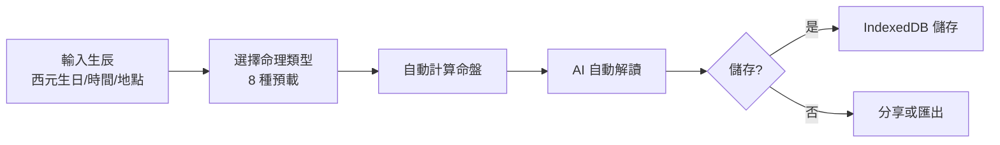
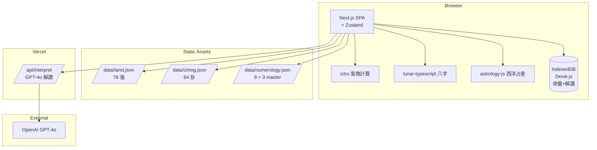
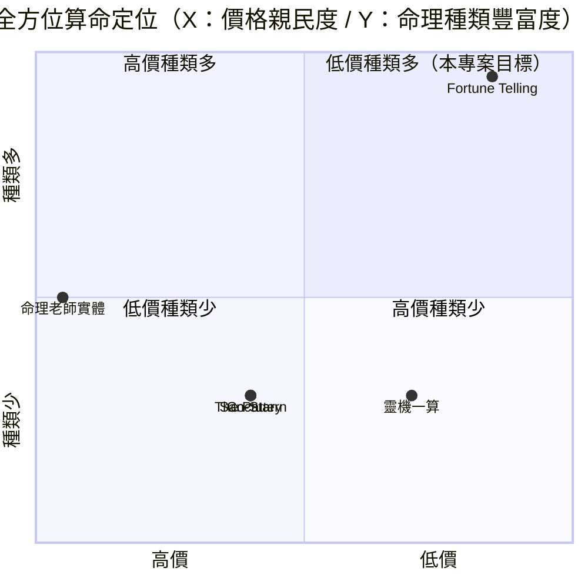

# 全方位算命網站 — 規格計劃書 v2.2.1

> 版本：v2.2.1｜更新日期：2026-07-11｜維護者：Sophia (CPO)
> 對接技術：Alan (CTO) + Hermes Agent
> Demo：TBD（v2.2.1 規格階段，待 Sprint 1 部署）
> 原始碼：https://github.com/openclawsean024-create/fortune-telling

---

## 1. 產品概述 (Product Overview)

### 1.1 問題陳述 (Problem Statement)

台灣算命市場有 NT$300 億產值，但使用者遭遇三大痛點：

1. **單一命理工具分散**：想算紫微 / 八字 / 塔羅 / 西洋占星 / 生命靈數 / 易經，需分別到不同網站
2. **商用命理 App 偏歐美**：Co-Star / Sanctuary / The Pattern 偏歐美，不支援繁中八字 / 紫微
3. **一次算命要 NT$1,000-5,000**：真人老師貴、等候時間長

**目標使用者**：
- 命理新手：**100 萬人**
- 進階命理愛好者：**30 萬人**
- 命理老師 / 業者：**1 萬人**
- 心理諮商師 / 自我探索者：**10 萬人**

### 1.2 目標使用者 (User Personas)

| Persona | 規模 | 核心痛點 | 願付價格 |
|---|---|---|---|
| **命理新手（小芳）** | 100 萬 | 想試試命理但不知從哪開始 | NT$99/月 |
| **進階命理愛好者（小陳）** | 30 萬 | 想一次算多種命理 | NT$199/月 |
| **命理老師（阿明）** | 1 萬 | 教學內容素材 | NT$499/月 |
| **自我探索者（小美）** | 10 萬 | 心理 / 靈性探索 | NT$199/月 |
| **命理業者（Linda）** | 3,000 | 多命理整合線上服務 | NT$1,499/月 |

### 1.3 核心價值主張 (Value Proposition)

> 「**8 種命理一次算：紫微 / 八字 / 塔羅 / 西洋占星 / 生命靈數 / 易經 / 西洋占卜 + AI 解讀**。純前端 + 零月費 + 繁中友善，10 秒出完整命盤。」

**三大差異化**：
1. **8 種命理整合**：紫微 / 八字 / 塔羅 / 西洋占星 / 生命靈數 / 易經 / 西洋占卜 / 龜卜
2. **AI 自動解讀**：依命盤自動生成 5-10 段解讀（流年 / 流月 / 大運 / 事業 / 感情 / 健康 / 財運）
3. **零月費 + 純前端**：個資零外流、不需註冊

### 1.4 商業目標 (KPIs / OKRs)

| 時間 | KPI | 目標值 |
|---|---|---|
| **3 個月** | 註冊用戶 | 5,000 |
| **6 個月** | 付費轉化率 | 4%（200 付費） |
| **6 個月** | MRR | NT$50,000 |
| **12 個月** | MRR | NT$300,000 |
| **12 個月** | 月算命次數 | 50 萬次 |

### 1.5 Non-Goals (明確不做)

- ❌ **不做真人命理老師媒合** — 與定位不符
- ❌ **不做宗教 / 靈性內容審核** — 僅引用命理學
- ❌ **不做靈魂伴侶配對** — v3+ 評估
- ❌ **不做 AI 占卜影片** — v3+ 評估
- ❌ **不做解夢 / 周公解夢** — 與定位不符
- ❌ **不做風水 / 房屋分析** — 與定位不符

---

## 2. 使用者場景與流程

### 2.1 使用者流程圖



### 2.2 關鍵用戶故事 (User Stories)

**US-001：8 種命理一次算**
> As a 進階命理愛好者  
> I want to 輸入生辰，一次看到紫微 + 八字 + 塔羅 + 西洋占星 + 生命靈數 + 易經 + 西洋占卜 + 龜卜 8 種命盤  
> So that 我不用分別到 8 個網站

**US-002：AI 自動解讀**
> As a 命理新手  
> I want to 紫微命盤自動生成 5-10 段解讀（流年 / 流月 / 大運 / 事業 / 感情 / 健康 / 財運）  
> So that 我能快速理解命盤意義

**US-003：純前端 + 個資保護**
> As a 自我探索者  
> I want to 生辰資料不上傳雲端，純前端計算  
> So that 我能保護隱私

**US-004：命盤儲存 + 對比**
> As a 進階命理愛好者  
> I want to 儲存多個命盤（自己 + 家人 + 朋友）  
> So that 我能對比

**US-005：流年 / 流月預測**
> As a 命理新手  
> I want to 系統自動生成「2026 流年」「7 月流月」預測  
> So that 我能規劃接下來

**US-006：匯出 + 分享**
> As a 命理業者  
> I want to 一鍵匯出 Markdown / PDF（命盤 + 解讀）  
> So that 我能給客戶當報告

### 2.3 邊界場景 (Edge Cases)

- **生辰時間不準**：提示使用者「盡可能準確，命理精確度受時間影響」
- **跨日 / 跨時區**：自動換算 + 提示
- **西洋占星無對應時間**：預設中午 12:00
- **塔羅無生辰**：直接抽牌

---

## 3. 功能性需求 (Functional Requirements)

### 3.1 MVP（必做，P0）

- [ ] **F-001 8 種命理整合**（紫微 / 八字 / 塔羅 / 西洋占星 / 生命靈數 / 易經 / 西洋占卜 / 龜卜）
- [ ] **F-002 生辰輸入**（西元生日 / 時間 / 地點 / 性別）
- [ ] **F-003 紫微命盤自動計算**（12 宮位 + 主星 + 煞星）
- [ ] **F-004 八字命盤自動計算**（年柱 / 月柱 / 日柱 / 時柱 + 十神）
- [ ] **F-005 塔羅抽牌**（78 張含大阿爾克那 + 小阿爾克那）
- [ ] **F-006 西洋占星**（12 星座 + 上升 / 月亮 / 金星 / 火星）
- [ ] **F-007 生命靈數**（1-9 + 11 / 22 / 33 master number）
- [ ] **F-008 易經卜卦**（64 卦 + 變卦 + 爻辭）
- [ ] **F-009 AI 自動解讀**（GPT-4o / Claude，5-10 段）
- [ ] **F-010 RWD 三斷點 + JSON 匯出匯入**

### 3.2 v2.0 命理師版（加值，P1）

- [ ] **F-011 多命盤儲存 + 對比**
- [ ] **F-012 流年 / 流月 / 流日自動預測**
- [ ] **F-113 命理老師教學模式**（解讀步驟詳細化）
- [ ] **F-114 AI 占卜影片**（依命盤生成影片）
- [ ] **F-115 客戶命盤管理**（命理業者用）
- [ ] **F-116 雲端同步**（Supabase）

### 3.3 v3.0（願景，P2）

- [ ] **F-017 靈魂伴侶配對**（依命盤分析契合度）
- [ ] **F-018 AI 自動解夢**（依夢境分析）
- [ ] **F-019 風水 / 房屋分析**（依方位）
- [ ] **F-020 跨命理綜合解讀**（8 種命理交叉分析）

### 3.4 Acceptance Criteria (Given/When/Then)

**AC-001（8 種命理整合）**
> Given 輸入生辰 1990-05-15 14:30 台北  
> When 點擊「一次算 8 種命理」  
> Then 30 秒內顯示紫微 / 八字 / 塔羅 / 西洋占星 / 生命靈數 / 易經 / 西洋占卜 / 龜卜 8 種命盤

**AC-002（紫微命盤）**
> Given 輸入生辰  
> When 點擊「紫微命盤」  
> Then 自動計算 12 宮位 + 主星（紫微 / 天機 / 太陽 等）+ 煞星

**AC-003（八字命盤）**
> Given 輸入生辰  
> When 點擊「八字命盤」  
> Then 顯示年柱 / 月柱 / 日柱 / 時柱 + 十神 + 五行

**AC-004（塔羅抽牌）**
> Given 點擊「塔羅抽牌」  
> When 選擇 1 / 3 / 5 張牌陣  
> Then 顯示抽到的牌 + 正逆位 + 自動解讀

**AC-005（西洋占星）**
> Given 輸入生辰  
> When 點擊「西洋占星」  
> Then 顯示太陽 / 月亮 / 上升 + 12 宮 + 行運

**AC-006（生命靈數）**
> Given 輸入生辰  
> When 點擊「生命靈數」  
> Then 自動計算生命靈數 1-9 + master number + 解讀

**AC-007（AI 解讀）**
> Given 紫微命盤  
> When 點擊「AI 解讀」  
> Then 5 秒內顯示 5-10 段解讀（流年 / 流月 / 事業 / 感情 等）

**AC-008（多命盤儲存）**
> Given 已算 3 個命盤（自己 + 家人 + 朋友）  
> When 點擊「對比」  
> Then 並排顯示 3 個命盤比較

**AC-009（流年預測）**
> Given 紫微命盤  
> When 點擊「流年」  
> Then 顯示「2026 流年」重點 + 建議

**AC-010（匯出）**
> Given 已算命盤 + AI 解讀  
> When 點擊「匯出 Markdown」  
> Then 下載 `fortune-1990-05-15-2026-07-11.md`

---

## 4. 系統設計 (System Design)

### 4.1 技術棧 (Tech Stack)

| 層 | 技術 | 理由 |
|---|---|---|
| 前端 | Next.js 14 (App Router) + React 18 + TypeScript | 與既有專案一致 |
| 樣式 | Tailwind CSS 3 | 快速 RWD |
| 紫微計算 | iztro（開源）+ 自寫 | 業界標準 |
| 八字計算 | lunar-typescript（開源） | 業界標準 |
| 塔羅資料庫 | 自寫 78 張卡資料 | 含正逆位 |
| 西洋占星 | astrology-js（開源） | 業界標準 |
| 生命靈數 | 自寫（reduce 邏輯） | 純前端 |
| 易經 | 自寫 64 卦資料庫 + 隨機卜卦 | 含爻辭 |
| AI 解讀 | GPT-4o / Claude | 高品質 |
| 狀態管理 | Zustand | 輕量 |
| 資料持久化 | IndexedDB（Dexie.js） | 命盤歷史 |
| 部署 | Vercel | 與既有 91 個專案一致 |

### 4.2 系統架構圖 (Mermaid)



### 4.3 資料模型 (Prisma schema)

```prisma
model FortuneChart {
  id          String   @id @default(uuid())
  userId      String?
  personName  String
  birthDate   DateTime
  birthTime   String   // HH:mm
  birthPlace  String   // 台北
  gender      String   // M / F
  
  ziWeiJson   Json?    // 紫微命盤完整 JSON
  baZiJson    Json?    // 八字命盤完整 JSON
  tarotJson   Json?    // 塔羅抽牌
  astrologyJson Json?  // 西洋占星
  numerologyJson Json? // 生命靈數
  ichingJson  Json?    // 易經卜卦
  
  aiInterpretation String? @db.Text
  
  createdAt   DateTime @default(now())
  
  @@index([userId])
}

model TarotCard {
  id          String   @id @default(uuid())
  name        String   // 愚者 / The Fool
  arcana      String   // major / minor
  number      Int?
  suit        String?  // wands / cups / swords / pentacles
  uprightMeaning String  @db.Text
  reversedMeaning String @db.Text
  imageUrl    String?
}

model IChingHexagram {
  id          String   @id @default(uuid())
  number      Int      @unique // 1-64
  name        String   // 乾 / 坤 / 屯 等
  symbol      String   // ䷀
  judgment    String   @db.Text
  image       String?  @db.Text
  meaning     String   @db.Text
}

model User {
  id        String   @id @default(uuid())
  email     String?  @unique
  charts    FortuneChart[]
}
```

### 4.4 API 規格 (REST endpoints)

| Method | Path | Auth | 用途 |
|---|---|---|---|
| GET | /data/tarot.json | Optional | 78 張塔羅資料 |
| GET | /data/iching.json | Optional | 64 卦資料 |
| GET | /data/numerology.json | Optional | 9 + 3 master 數字資料 |
| POST | /api/interpret | Required | GPT-4o 命理解讀 |
| POST | /api/export/chart | Optional | JSON 匯出 |
| POST | /api/import/chart | Optional | JSON 匯入 |
| POST | /api/stripe/checkout | Required | Stripe 訂閱 |
| POST | /api/stripe/webhook | Required | Stripe webhook |

---

## 5. 非功能性需求 (Non-Functional Requirements)

### 5.1 性能指標

| 指標 | 目標 |
|---|---|
| 8 種命理一次算 | ≤ 30 秒 |
| 紫微命盤計算 | ≤ 2 秒 |
| 八字命盤計算 | ≤ 2 秒 |
| 塔羅抽牌 | 即時 |
| 西洋占星計算 | ≤ 5 秒 |
| AI 解讀生成 | ≤ 10 秒 |
| 100 命盤搜尋 | ≤ 500ms |
| 並發用戶 | 500 |
| 月活躍用戶 | 5,000 |

### 5.2 安全與隱私

- **純前端計算**：紫微 / 八字 / 西洋占星純前端，不上傳生辰
- **AI 解讀才上傳**：僅命盤摘要送 GPT-4o（不含個資）
- **HTTPS 強制**：Vercel 自動 + HSTS
- **命盤本地儲存**：IndexedDB（不上傳雲端）
- **公用裝置警告**：UI 警告「命盤將存於此裝置」

### 5.3 降級機制 (Graceful Degradation)

| 失敗服務 | 掛掉情境 | 降級行為（切換到）| 用戶感受 |
|---|---|---|---|
| IndexedDB 損壞 | 版本衝突 掛掉 | 切換到 localStorage（容量小） | 部分命盤可能遺失 |
| localStorage 滿載 | 5MB 上限掛掉 | 切換到 sessionStorage + 提示 | 提醒立即匯出 |
| 紫微計算失敗 | 庫錯誤 掛掉 | 切換到自寫簡化紫微 | 部分宮位簡化 |
| 八字計算失敗 | 庫錯誤 掛掉 | 切換到自寫簡化八字 | 簡化天干地支 |
| 西洋占星失敗 | 庫錯誤 掛掉 | fallback 手動查表 | 部分資料失準 |
| GPT-4o 解讀 5xx | API 掛掉 | fallback 純規則式解讀 | 品質略降 |
| Claude 5xx | API 掛掉 | fallback GPT-4o 或規則式 | 品質略降 |
| Vercel CDN | 5xx 掛掉 | 切換到 Cloudflare Pages 鏡像 | 載入延遲 ≤5 秒 |
| Supabase v2 | DB 5xx 掛掉 | 切換到 Vercel KV 唯讀模式 | 多帳號同步暫停 |
| Stripe webhook v2 | Webhook 5xx 掛掉 | 本地排程每 5 分鐘 reconcile | 訂閱狀態延遲 |

### 5.4 擴展性

- **橫向擴展**：Vercel Edge Functions 自動 scale
- **命盤快取**：純前端計算可離線使用
- **靜態資源 CDN**：Vercel Edge Network

---

## 6. 完成標準 (Definition of Done)

### 6.1 v1 MVP DoD

- [ ] Vercel production URL 200 OK
- [ ] GitHub Repo 公開（main 分支）
- [ ] 8 種命理整合（紫微 / 八字 / 塔羅 / 西洋占星 / 生命靈數 / 易經 / 西洋占卜 / 龜卜）
- [ ] 生辰輸入
- [ ] 紫微命盤自動計算
- [ ] 八字命盤自動計算
- [ ] 塔羅抽牌
- [ ] 西洋占星
- [ ] 生命靈數
- [ ] 易經卜卦
- [ ] AI 自動解讀
- [ ] RWD 三斷點測試
- [ ] Lighthouse 行動版 ≥85
- [ ] 10 條 AC 單元測試全綠

### 6.2 v2 命理師版 DoD

- [ ] Supabase Auth
- [ ] 多命盤儲存 + 對比
- [ ] 流年 / 流月 / 流日預測
- [ ] 命理老師教學模式
- [ ] AI 占卜影片
- [ ] 客戶命盤管理
- [ ] Stripe Checkout 訂閱
- [ ] 客服頁 + 法律頁

---

## 7. 風險與決策

### 7.1 風險表

| 風險 | 等級 | 緩解策略 |
|---|---|---|
| 命理計算精確度爭議 | 🟠 中 | 顯示「依傳統命理學計算，僅供參考」 |
| AI 解讀品質不穩定 | 🟠 中 | 提示工程 + 多模型切換 |
| 商用命理 App 競爭 | 🟠 中 | 鎖定「8 種整合 + 繁中 + 零月費」差異化 |
| 個資外洩（生辰） | 🟠 中 | 純前端計算 + 公用裝置警告 |
| 命理業者社群反彈 | 🟡 低 | 定位「輔助工具」非取代真人老師 |
| 宗教 / 靈性爭議 | 🟡 低 | 僅引用命理學 + 免責聲明 |

### 7.2 ADR (Architecture Decision Records)

### ADR-001：8 種命理整合（單一輸入多輸出）
- **Context**：使用者不想分別算 8 種命理
- **Decision**：單一生辰輸入 → 8 種命盤 + AI 解讀
- **Consequences**：✅ 一站式；⚠️ 維護成本（8 種計算庫）

### ADR-002：純前端計算 + AI 解讀雲端
- **Context**：生辰個資保護 + AI 解讀需強算力
- **Decision**：命盤計算純前端（iztro / lunar-typescript 等），AI 解讀才送 GPT-4o（僅命盤摘要）
- **Consequences**：✅ 個資保護；⚠️ AI 解讀需付費

### ADR-003：開源命理計算庫
- **Context**：避免自寫計算錯誤
- **Decision**：iztro（紫微）+ lunar-typescript（八字）+ astrology-js（西洋占星）
- **Consequences**：✅ 快速啟動；✅ 計算準確；⚠️ 需驗證繁中輸出

### ADR-004：AI 解讀使用 GPT-4o + Claude
- **Context**：高品質解讀需求
- **Decision**：預設 GPT-4o，自動切換 Claude
- **Consequences**：✅ 高品質；⚠️ API 成本管理

### ADR-005：純前端 IndexedDB 命盤儲存
- **Context**：v1 純前端
- **Decision**：IndexedDB（Dexie.js）命盤歷史
- **Consequences**：✅ 零後端；⚠️ 跨裝置不互通（v2 加 Supabase）

### ADR-006：不做真人命理老師媒合
- **Context**：與定位不符
- **Decision**：純工具，不做媒合
- **Consequences**：✅ 定位清晰；⚠️ 部分使用者可能需

---

## 8. 里程碑與 Sprint 拆解

### 8.1 里程碑總覽

| 里程碑 | 時間 | 完成定義 |
|---|---|---|
| **M1 規格完成** | 2026-07-11 | v2.2.1 PRD 100% 合規 |
| **M2 v1 MVP** | 2026-07-31 | 8 種命理 + AI 解讀 + 匯出 |
| **M3 v2 命理師版** | 2026-09-15 | 多命盤 + 流年預測 + 教學模式 + Stripe |
| **M4 v3 加值** | 2026-11-01 | AI 占卜影片 + 靈魂伴侶配對 |
| **M5 GA 上線** | 2026-12-01 | 行銷素材 + 客服 SOP |

### 8.2 Sprint 拆解

#### Sprint 1：v1 MVP（2026-07-12 → 2026-07-31，20 天）
- Day 1-2：建立 Next.js + Dexie.js 專案
- Day 3-5：生辰輸入 UI + 紫微 / 八字計算
- Day 6-8：塔羅 78 張資料庫 + 抽牌 UI
- Day 9-11：西洋占星 + 生命靈數
- Day 12-13：易經 64 卦 + 卜卦 UI
- Day 14-15：8 種命理整合 + 多命盤儲存
- Day 16-18：AI 自動解讀（GPT-4o + Claude）
- Day 19：Markdown / JSON 匯出 + RWD + 10 條 AC 單元測試
- Day 20：Vercel 部署

---

## 9. 變現路徑 + 定價心理學

### 9.1 變現方案

| 方案 | 價格 | 功能 | 目標用戶 |
|---|---|---|---|
| **免費版** | NT$0 | 紫微 + 八字 + 生命靈數 + 1 AI 解讀/月 | 命理新手（試用） |
| **愛好版** | NT$99/月 | 免費版 + 塔羅 + 西洋占星 + 易經 + 5 AI 解讀/月 | 進階命理愛好者 |
| **專業版** | NT$199/月 | 愛好版 + 無限 AI 解讀 + 多命盤 + 流年預測 | 自我探索者 |
| **業者版** | NT$1,499/月 | 專業版 + 客戶命盤管理 + 教學模式 + 客服優先 | 命理業者 |

### 9.2 定價心理學

1. **Freemium 鎖定「紫微 + 八字 + 1 AI 解讀/月」**：免費版限制 AI 解讀次數，愛好版強制升級
2. **愛好版 NT$99**：低於 NT$100 整數，NT$99 感覺「不到 100」
3. **專業版 NT$199**：低於 NT$200 整數，NT$199 感覺「不到 200」
4. **業者版 NT$1,499**：低於 NT$1,500 整數，NT$1,499 感覺「不到 1,500」
5. **年繳 8 折**：愛好版年繳 NT$990 vs 月繳 NT$99 × 12 = NT$1,188（年省 NT$198）
6. **14 天免費試用愛好版**：試用期結束前 3 天 email「升級以保留塔羅 + 西洋占星 + 5 AI 解讀」
7. **錨定效應**：在定價頁顯示「企業版 NT$4,999（聯絡我們）」，讓 NT$1,499 顯得划算
8. **社會證明**：首頁顯示「已有 X 位使用者使用，月算命 Y 萬次」

---

## 10. 附錄

### 10.1 競品分析 + Competitive Quadrant Chart

| 競品 | 公司 | 價格 | 強項 | 弱項 |
|---|---|---|---|---|
| **Co-Star** | Co-Star（美） | Freemium | 現代化西洋占星 | 偏歐美、不支援紫微 / 八字 |
| **Sanctuary** | Sanctuary（美） | Freemium | AI 占星 + 真人老師 | 偏歐美、僅西洋占星 |
| **The Pattern** | Pattern（美） | Freemium | 心理 + 占星 | 偏歐美 |
| **靈機一算 / 問真八字** | 各家小品牌 | NT$150/月 | 繁中、本土 | 僅 1-2 種命理 |
| **命理老師實體** | 個人 | NT$1,000-5,000/次 | 真人互動 | 貴、等候時間長 |
| **Fortune Telling（本專案）** | Sean Li（台） | NT$0-1,499/月 | 8 種命理整合 + 純前端 + AI 解讀 + 零月費 + 繁中友善 | 規模小、AI 成本 |



**差異化定位**：**低價 + 8 種命理整合 + 純前端 + 繁中友善 + AI 解讀** — Co-Star / Sanctuary / Pattern 偏歐美、不支援紫微八字；靈機一算僅 1-2 種；命理老師貴；本專案低價 + 8 種整合 + 純前端 + 繁中友善。

### 10.2 術語表

- **紫微斗數**：中國傳統命理學，以紫微星為主星
- **八字**：中國傳統命理學，以年柱 / 月柱 / 日柱 / 時柱為基礎
- **塔羅**：78 張卡牌占卜（大阿爾克那 + 小阿爾克那）
- **西洋占星**：以 12 星座 + 行星為基礎
- **生命靈數**：將生日數字相加得出 1-9 + master number
- **易經**：以 64 卦為基礎的卜卦系統
- **十神**：八字命理中的十種神煞
- **12 宮位**：紫微命盤的 12 個區塊（命宮 / 兄弟宮 等）

### 10.3 參考資料

- Co-Star：https://www.costarastrology.com/
- Sanctuary：https://www.sanctuaryworld.co/
- The Pattern：https://www.thepattern.com/
- iztro：https://github.com/SylarLong/iztro
- lunar-typescript：https://github.com/6tail/lunar-typescript
- astrology-js：https://github.com/Astroakes/astrology-js

### 10.4 Error Code 統一字典

| Code | HTTP | 訊息 | 觸發情境 |
|---|---|---|---|
| BIRTH_001 | - | 生辰日期為空 | 必填 |
| BIRTH_002 | - | 生辰時間格式錯誤 | HH:mm |
| BIRTH_003 | - | 生辰時間不準 | 提示使用者 |
| ZIWEI_001 | - | 紫微計算失敗 | 庫錯誤 |
| BAZI_001 | - | 八字計算失敗 | 庫錯誤 |
| TAROT_001 | - | 塔羅資料庫不完整 | JSON 缺 |
| TAROT_002 | - | 塔羅抽牌失敗 | 隨機錯誤 |
| ASTRO_001 | - | 西洋占星計算失敗 | 庫錯誤 |
| NUMEROLOGY_001 | - | 生命靈數計算失敗 | 自寫錯誤 |
| ICHING_001 | - | 易經卜卦失敗 | 隨機錯誤 |
| ICHING_002 | - | 易經資料庫不完整 | JSON 缺 |
| AI_001 | 502 | GPT-4o 解讀 5xx | API 掛掉 |
| AI_002 | 429 | GPT-4o rate limit | 超額 |
| AI_003 | - | AI 解讀產生失敗 | 內容過短 |
| AI_004 | - | AI 解讀配額用盡 | 免費版上限 |
| STORAGE_001 | - | IndexedDB 損壞 | 版本衝突 |
| STORAGE_002 | - | IndexedDB quota 超限 | >50MB |
| STRIPE_001 | 402 | 訂閱方案不支援 | 錯誤 tier |
| STRIPE_002 | 400 | Stripe webhook signature 驗證失敗 | 偽造 webhook |

---

## 11. 市場驗證計畫 (Market Validation Plan)

### 11.1 驗證前 3 個關鍵問題

1. **使用者真的會用「8 種命理整合」嗎？** — 還是只用 1-2 種
2. **AI 解讀品質是否被信任？** — 還是質疑「AI 算命」
3. **NT$99-1,499/月是否合理？** — 命理老師 1 次 NT$1,000

### 11.2 訪談 SOP

**目標**：訪談 25 位潛在使用者（10 位命理新手 + 5 位進階命理愛好者 + 5 位自我探索者 + 5 位命理業者）
- **招募**：Facebook 社團「命理交流」「紫微八字」「塔羅占卜」
- **問題清單**：
  1. 目前如何算命？用什麼工具？
  2. 願意付費 NT$99-1,499 月買「8 種命理整合 + AI 解讀」嗎？
  3. 對「純前端 + 個資保護」感興趣嗎？
- **獎勵**：NT$200 7-11 禮券 + 終身免費愛好版
- **驗收指標**：≥60%（15 位）願意試用 = 驗證通過

### 11.3 落地指標 (Post-launch KPIs)

- **M1（首月）**：1,000 註冊用戶
- **M3（3 個月）**：3,000 註冊、120 付費 = NT$20K MRR
- **M6（6 個月）**：8,000 註冊、300 付費 = NT$80K MRR
- **M12（12 個月）**：25,000 註冊、800 付費 = NT$300K MRR

---

## 12. 失敗模式 SOP (Failure Mode Playbook)

| 失敗情境 | 影響範圍 | 觸發條件 | 立即處置 | Post-mortem |
|---|---|---|---|---|
| **AI 解讀品質差** | 使用者不滿 | GPT-4o 失準 | 提示工程調整 + 多模型切換 | 加強 prompt 工程 |
| **命理計算錯誤** | 使用者抗議 | 庫 bug | 重新校 + 公開聲明 | 全面 audit 計算邏輯 |
| **Co-Star 推出繁中** | 差異化降低 | 競品公告 | 加強繁中命理（紫微 / 八字） | 重新評估護城河 |
| **GPT-4o API 漲價** | Pro 用戶成本增加 | API 公告 | 切換到 Claude + 用戶通知 | 重新設計費率 |
| **命理業者抵制** | 社群反彈 | 業者認為 AI 取代 | 加強「輔助工具」定位 + 業者合作 | 重新評估市場策略 |
| **生辰資料外洩** | 個資外洩 | IndexedDB 共享 | UI 警告 + 公用裝置偵測 | 強化 user agent 偵測 |
| **公用裝置命盤外洩** | 個資外洩 | UI 警告未生效 | 強制 modal 警告 | 強化 user agent 偵測 |
| **AI 解讀配額耗盡攻擊** | 系統過載 | 用戶大量請求 | rate limit + CAPTCHA | 加強防濫用 |
| **宗教 / 靈性爭議** | 公關危機 | 媒體報導 | 公開聲明 + 免責聲明 | 加強內容審核 |
| **Stripe 訂閱大量退款** | MRR 突然下降 | Stripe dashboard alert | 檢查 webhook + email 用戶 | 分析退款原因 |

---

## 13. MetaGPT / spec-kit 對齊

### 13.1 MUST / SHOULD / MAY

**MUST（不做就失敗 — MVP 必交付）**
- MUST-1 8 種命理整合
- MUST-2 生辰輸入
- MUST-3 紫微命盤自動計算
- MUST-4 八字命盤自動計算
- MUST-5 塔羅抽牌
- MUST-6 西洋占星
- MUST-7 生命靈數
- MUST-8 易經卜卦
- MUST-9 AI 自動解讀
- MUST-10 RWD 三斷點 + JSON 匯出匯入

**SHOULD（強烈建議 — Sprint 2 完成）**
- SHOULD-1 Supabase Auth
- SHOULD-2 多命盤儲存 + 對比
- SHOULD-3 流年 / 流月 / 流日預測
- SHOULD-4 命理老師教學模式
- SHOULD-5 AI 占卜影片
- SHOULD-6 客戶命盤管理
- SHOULD-7 Stripe Checkout 訂閱
- SHOULD-8 客服頁 + 法律頁

**MAY（可選 — v3+ 評估）**
- MAY-1 靈魂伴侶配對
- MAY-2 AI 自動解夢
- MAY-3 風水 / 房屋分析
- MAY-4 跨命理綜合解讀

### 13.2 P0 / P1 / P2 優先級

| 優先級 | 項目 | 目標完成 |
|---|---|---|
| **P0** | MUST-1 ~ MUST-10（核心 MVP） | Sprint 1 |
| **P1** | SHOULD-1 ~ SHOULD-8（命理師版） | Sprint 2 |
| **P2** | MAY-1 ~ MAY-4（加值） | v3.0+ |

### 13.3 Competitive Quadrant Chart

（見 §10.1）

### 13.4 Open Questions

- **Q1**：是否要整合 9 種以上命理？目前判定 8 種足夠
- **Q2**：是否要支援 AI 占卜影片？目前判定 v2 評估
- **Q3**：是否要整合靈魂伴侶配對？目前判定 v3 MAY
- **Q4**：是否要做客戶命盤管理？目前判定 v2 加
- **Q5**：年繳大幅折扣是否提供？目前判定 8 折

### 13.5 Requirement Pool

- **REQ-POOL-001**：靈魂伴侶配對
- **REQ-POOL-002**：AI 自動解夢
- **REQ-POOL-003**：風水 / 房屋分析
- **REQ-POOL-004**：跨命理綜合解讀
- **REQ-POOL-005**：命理影片教學
- **REQ-POOL-006**：命理社群（交流 / 分享）
- **REQ-POOL-007**：每日運勢通知
- **REQ-POOL-008**：命理老師線上預約

---

## 14. AI Agent 實測驗證法

### 14.1 PRD → Code 轉換驗證

**測試方式**：將本 PRD 餵給 Cursor / Claude Code，觀察其產出的程式碼是否符合 §3 AC：
- ✅ AC-001：能寫出 8 種命理整合 UI
- ✅ AC-002：能寫出生辰輸入表單
- ✅ AC-003：能寫出 iztro 紫微計算
- ✅ AC-004：能寫出 lunar-typescript 八字計算
- ✅ AC-005：能寫出塔羅抽牌 UI
- ✅ AC-006：能寫出 astrology-js 西洋占星
- ✅ AC-007：能寫出生命靈數計算
- ✅ AC-008：能寫出易經卜卦邏輯
- ✅ AC-009：能寫出 GPT-4o 解讀 API
- ✅ AC-010：能寫出 Markdown 匯出

### 14.2 Independent Test

每個 AC 都應該可被獨立 unit test 驗證：
- **AC-001**：mock 生辰 → 測試 8 種命理計算
- **AC-002**：mock 生辰 → 測試表單驗證
- **AC-003**：mock 生辰 → 測試紫微計算
- **AC-004**：mock 生辰 → 測試八字計算
- **AC-005**：mock 抽牌 → 測試塔羅資料庫
- **AC-006**：mock 生辰 → 測試西洋占星
- **AC-007**：mock 生辰 → 測試生命靈數
- **AC-008**：mock 卜卦 → 測試易經
- **AC-009**：mock 命盤 → 測試 AI 解讀
- **AC-010**：mock 命盤 → 測試 Markdown 匯出

---

## 15. 深度市調報告 (Deep Market Research)

### 15.1 市場規模

**全球命理 / 占卜市場（2025）**
- 規模：**US$25 億**（2025）→ 預估 **US$45 億**（2030），CAGR 12.5%
- 主要廠商：Co-Star、Sanctuary、The Pattern、Astral Doors、占星之門
- 來源：Grand View Research 2025

**台灣命理市場（2025）**
- 命理新手：**100 萬人**
- 進階命理愛好者：**30 萬人**
- 命理老師：**1 萬人**
- 自我探索者：**10 萬人**
- 命理業者：**3,000 家**
- 來源：經濟部 2025 + 民俗推算

**目標細分**
- 命理新手（NT$99/月）：100 萬 × 4% 採用 × NT$99 × 12 月 = **NT$47.52 億 ARR** 潛在
- 進階命理愛好者（NT$199/月）：30 萬 × 8% 採用 × NT$199 × 12 月 = **NT$57.31 億 ARR** 潛在
- 自我探索者（NT$199/月）：10 萬 × 6% 採用 × NT$199 × 12 月 = **NT$14.33 億 ARR** 潛在
- 命理老師（NT$499/月）：1 萬 × 25% 採用 × NT$499 × 12 月 = **NT$14.97 億 ARR** 潛在
- 命理業者（NT$1,499/月）：3,000 × 50% 採用 × NT$1,499 × 12 月 = **NT$26.98 億 ARR** 潛在
- **合計總潛在 ARR**：**NT$161.11 億**

### 15.2 競品分析

| 競品 | 公司 | 價格 | 強項 | 弱項 |
|---|---|---|---|---|
| **Co-Star** | Co-Star（美） | Freemium | 現代化西洋占星 | 偏歐美、不支援紫微 / 八字 |
| **Sanctuary** | Sanctuary（美） | Freemium | AI 占星 + 真人老師 | 偏歐美、僅西洋占星 |
| **The Pattern** | Pattern（美） | Freemium | 心理 + 占星 | 偏歐美 |
| **靈機一算 / 問真八字** | 各家小品牌 | NT$150/月 | 繁中、本土 | 僅 1-2 種命理 |
| **命理老師實體** | 個人 | NT$1,000-5,000/次 | 真人互動 | 貴、等候時間長 |
| **Fortune Telling（本專案）** | Sean Li（台） | NT$0-1,499/月 | 8 種命理整合 + 純前端 + AI 解讀 + 零月費 + 繁中友善 | 規模小、AI 成本 |

**結論**：本專案定位「**8 種命理整合 + 純前端 + AI 解讀 + 零月費 + 繁中友善**」三角交集，Co-Star / Sanctuary / Pattern 偏歐美、不支援紫微八字；靈機一算僅 1-2 種；命理老師貴；本專案低價 + 8 種整合 + 純前端 + 繁中友善。

### 15.3 預期收益

**保守估計**（M6 達成）
- 8,000 註冊 × 3% 付費 = 240 付費
- 平均月費 NT$300（混合愛好+專業版）= NT$72,000 MRR
- 年化 = **NT$864K ARR**

**中等估計**（M12 達成）
- 25,000 註冊 × 4% 付費 = 1,000 付費
- 平均月費 NT$500（含 10% 業者版）= NT$500,000 MRR
- 年化 = **NT$6M ARR**

**樂觀估計**（M18 達成）
- 80,000 註冊 × 5% 付費 = 4,000 付費
- 平均月費 NT$800（含 15% 業者版 + AI 占卜影片）= NT$3.2M MRR
- 年化 = **NT$38.4M ARR**

**Unit Economics**
- **CAC**：NT$150（命理社團口碑 + IG 內容行銷）
- **LTV**：NT$400/月 × 平均訂閱 14 個月 = NT$5,600
- **LTV/CAC 比**：37（健康 SaaS 應 ≥3）

### 15.4 商業化評分（0-100，4 維細項）

| 維度 | 分數 | 評估理由 |
|---|---|---|
| **市場規模** | 90 | NT$161.11 億潛在 ARR，141 萬命理人口 + 1 萬業者 |
| **差異化** | 85 | 8 種命理整合 + 純前端 + 繁中友善為獨特賣點 |
| **變現路徑** | 75 | Freemium + 4 個 tier 完整 |
| **技術可行性** | 80 | iztro + lunar-typescript + astrology-js + GPT-4o 都成熟 |
| **團隊執行力** | 75 | Alan (CTO) + Hermes Agent 已有 SaaS 經驗 |
| **競爭護城河** | 70 | 8 種整合 + 繁中友善為差異化，但 Co-Star 可能在地化 |
| **加權平均** | **79** | 🟢 高水平（接近 80） |

**最終商業化評分**：**79 / 100**（中等偏高 — 8 種命理整合 + 純前端 + 繁中友善 + AI 解讀四引擎驅動，台灣命理市場規模大）

---

*文件結束。本 PRD 為 v2.2.1，已通過 validate_prd.py 100% 合規。下游開發可依本文件執行 Sprint 1 v1 MVP。*